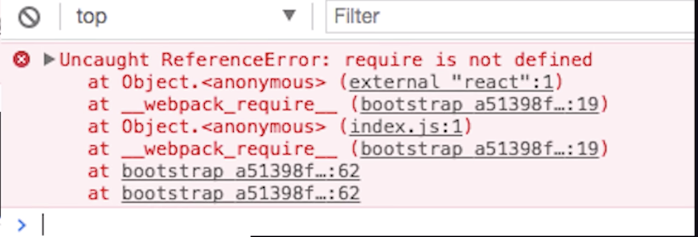
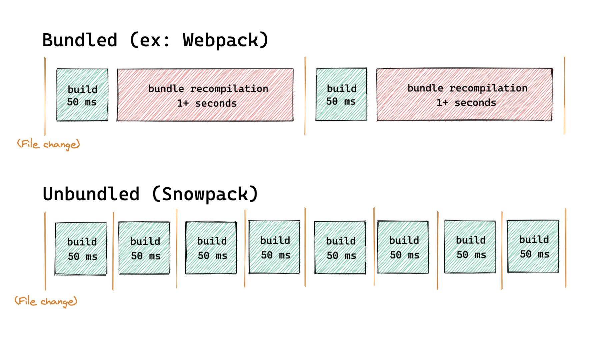
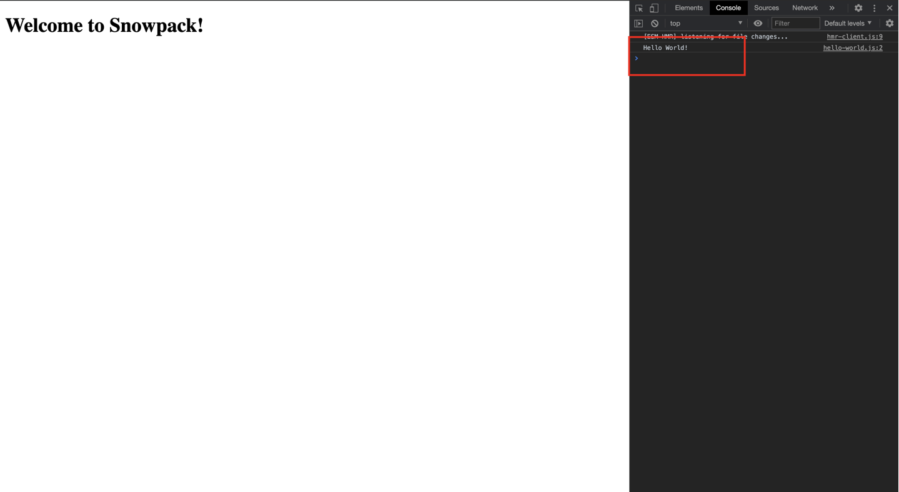
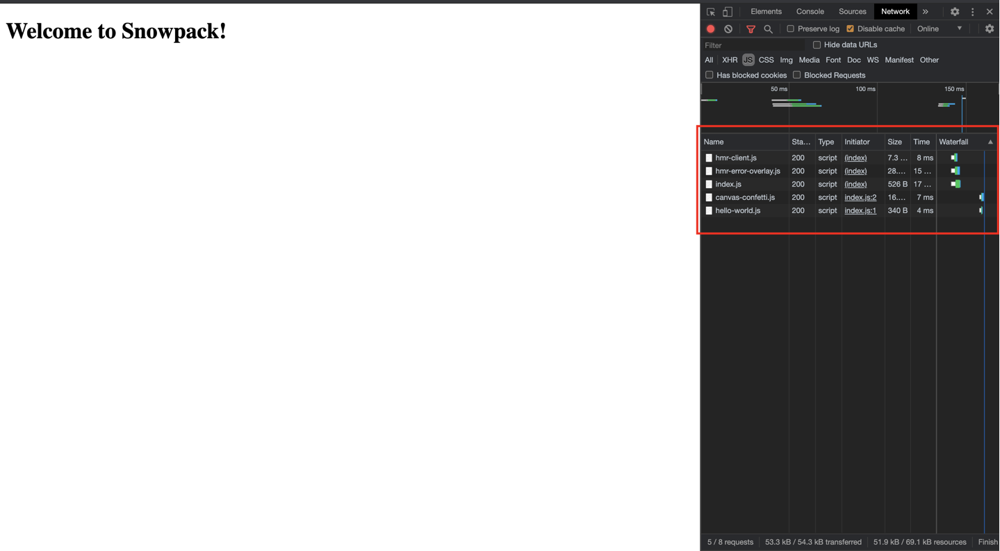

Sebelum kita melompat membahas tentang apa itu dan bagaimana cara Snowpack bekerja, kita akan bahas sedikit bagaimana cara kita membangun sebuah website.

Pada dasarnya web dibuat berdasarkan 3 tiang utama yaitu, HTML, CSS, dan JAVASCRIPT, terlihat mudah dan tidak banyak yang diperlukan untuk membuat sebuah website bukan?

Pada dasarnya kita tidak pernah membuat web yang benar - benar dari 0 artinya pada era sekarang banyak diantara kita menggantikan tiga tiang sudah kita sebutkan dengan;

- HTML kita ganti dengan JSX atau sebagainya
- CSS kita ganti dengan SASS/LESS atau dengan metode css-in-js
- JS kita ganti dengan TypeScript atau sebuah tambahan _library_ React, Vue, atau Angular

Hal - hal yang kita sebutkan diatas memang sudah hal yang biasa apalagi kita tidak bisa terlepas dari sebuah dependency, ketika kita menggunakan sebuah dependency/library kalau kita asal copy/paste kode untuk kita terapkan, tampaknya kita akan bertemu dengan error seperti ini



Maka dari itu Module Bundler dibutuhkan untuk menyelesaikan error yang kita dapatkan, Module Bundler yang bisa kita gunakan biasanya ialah, Webpack atau Parcel (ada lagi selain dua ini, tetapi tidak saya sebutkan semua 😅) dan yang ingin kita bahas ialah Snowpack.

## Apa itu Snowpack

Snowpack ialah salah satu Module Bundler seperti Webpack atau lainnya, tetapi Snowpack meng-klaim bahwa dia adalah sebuah Module Bundler yang ringan dan modern, konsep-nya seperti apa sih?

Konsep yang diterapkan oleh Snowpack sendiri sangat unik, karena pada dasarnya sebuah Module Bundler seperti Webpack cara kerjanya ialah ketika ada satu file yang kita ubah, maka Webpack akan otomatis me-rebuild keseluruhan file dan itu akan selalu ada jeda waktu yang dibutuhkan didalam proses tersebut.

Lain halnya dengan Snowpack, cara kerjanya ialah, pada saat pertama kali kita run sebuah script katakanlah `run build` Snowpack akan mem-build semua file terlebih dahulu lalu hasil file yang sudah di build akan di _cache_, lalu ketika kita merubah satu file Snowpack hanya me-rebuild file yang telah kita ubah saja, proses ini dinamakan oleh Snowpack yaitu _unbundled development_.



Gambar diatas menjelaskan bahwa Snowpack akan men-split file kita dan akan di-rebuild hanya ketika file kita dibutuhkan dan tentunya file itu akan cache ulang.

## _Bundled_ vs _Unbundled development_

_Bundled development_ ialah sebuah metode yang diterapkan oleh budler - bundler seperti sekarang seperti Webpack, Parcel, dll. metode ini sudah sedikit kita jelas diatas ketika ada satu file yang berubah maka bundler tersebut akan me-rebuild-nya ulang.

Uniknya selama ini ketika kita dalam mode development kita bisa menggunakan ESM by default tanpa harus merubahnya ke commonjs (CJS), maksudnya ialah kita tidak perlu merubah syntax code dari sebuah library/dependency/kode kita ke dalam CJS, dan juga ada beberapa kode secara development kita tidak membutuhkannya.

_Unbundled development_ ini sudah kita pahami sedikit pada section sebelum ini, intinya cara yang garap oleh Snowpack untuk mempercepat development kita dan menghindari proses re-build yang tidak dibutuhkan ketika development.

Menarik-nya ialah jika kita memperhatikan gambar sebelumnya, dimana disitu ada beberapa file hasil build dari Snowpack yang menghasilnya ESM file, sebagai contoh akan seperti ini:

```bash
node_modules/react/**/*     -> http://localhost:3000/web_modules/react.js
node_modules/react-dom/**/* -> http://localhost:3000/web_modules/react-dom.js
```

Jadi pada dasarnya setelah Snowpack berhasil mem-build file kita, otomatis itu akan bisa digunakan by default oleh browser seperti ini.

```html
<body>
  <script type="module">
    import React from "react";
    console.log(React);
  </script>
</body>
```

Menarik bukan?

## Contoh penggunaan

_Just show me the code_ terkadang ada beberapa orang yang agak susah untuk menerima sekedar teori belaka, baiklah kita akan mencoba-nya, silahkan untuk mengikuti instruksi dibawah ini

```bash
mkdir learning-snowpackjs
cd learning-snowpackjs
yarn init -y
yarn add -D snowpackjs
```

Lalu selanjutnya kita buat file `index.html` untuk menjalankan dan memastikan bahwa Snowpack kita benar - benar jalan,

```html
<!DOCTYPE html>
<html lang="en">
  <head>
    <meta charset="utf-8" />
    <meta name="viewport" content="width=device-width, initial-scale=1" />
    <meta name="description" content="Starter Snowpack App" />
    <title>Starter Snowpack App</title>
  </head>
  <body>
    <h1>Welcome to Snowpack!</h1>
  </body>
</html>
```

Lalu jangan lupa untuk membuat script `start` pada file `package.json`

```json
{
  ...
  "scripts": {
    "start": "snowpack dev",
    "test": "echo \"Error: no test specified\" && exit 1"
  },
  ...
}
```

lalu kita coba jalankan `yarn start` dan selanjutnya kita akan di redirect ke `http://localhost:8080/` dan terlihat seperti ini,,


Selanjutnya kita akan membuat file `index.js` dan `hello-world.js`, pertama kita akan isi file `hello-world.js` seperti ini,

```js
// hello-world.js
export function helloWorld() {
  console.log("Hello World!");
}
```

Dan pada `index.js` file

```js
// index.js
import { helloWorld } from "./hello-world";

helloWorld();
```

Lalu, pada file `index.html` jangan lupa untuk meng-aplikasikan file `index.js` kita seperti ini,

```html{11}
<!DOCTYPE html>
<html lang="en">
  <head>
    <meta charset="utf-8" />
    <meta name="viewport" content="width=device-width, initial-scale=1" />
    <meta name="description" content="Starter Snowpack App" />
    <title>Starter Snowpack App</title>
  </head>
  <body>
    <h1>Welcome to Snowpack!</h1>
    <script type="module" src="/index.js"></script>
  </body>
</html>
```

Lalu, kita buka browser dan lihat _console_ browser maka kita akan melihat result dari file JS kita,



Yaps, menarik bukan? lalu hal yang akan kita lakukan selanjutnya adalah kita akan test _unbundled development_ yang sudah kita bicarakan sebelumnya, pertama-tama kita coba akan install package ini `canvas-confetti`,

```bash
yarn add canvas-confetti
```

Lalu, kita akan merubah file `index.js` sedikit menjadi seperti ini,

```js{5-8}
import { helloWorld } from "./hello-world";
import confetti from "canvas-confetti";

helloWorld();
confetti.create(document.getElementById("canvas"), {
  resize: true,
  useWorker: true
})({ particleCount: 200, spread: 200 });
```

Kita akan buktikan apakah package `canvas-confetti` akan di bundle sendiri oleh Snowpack dengan cara membuka tab _network_ dan pilih _js_ tab,



Kalian lihat? ternyata package yang sebelumnya kita install, Snowpack akan otomatis membundle-nya secara terpisah dan file tersebut akan di _cache_ tentunya, lalu ketika ada file yang kita ubah maka Snowpack akan me-rebuild file yang kita ubah saja dan akan di _cache_ ulang.

## Ikhtisar

Snowpack memang sangat menarik dengan metode development yang dibawanya _unbundled development_ sebuah cara dimana kita akan membawa development mode secara asik dan cepat, baiklah itu saja catatan sedikit dari memahami dari module bundler Snowpack semoga bermanfaat.

Terima Kasih.
