In this post we gonna do an installation on React Native using _react Native Navigation WIX_ –– because there's gossip out there about RNN (React Native Navigation) it's kinda hard to install it, in fact, if you digging into the official documentation RNN [(here it's)](https://wix.github.io/react-native-navigation/#/) the guidance it's easy to follow it.

Before we jump into how-to-do-it I'm gonna share what's else the navigation that served by React Native.

- Default Navigation\
  Is navigation that's have been served default by RN itself, for example:
  - [Android](https://facebook.github.io/react-native/docs/navigator), This has been removed from core RN itself since version ^0.45.
  - [IOS](https://facebook.github.io/react-native/docs/navigatorios#docsNav), The good news is it's still maintained until now.
- JS Navigation\
  This navigation mechanism it's running under JS Code on the device itself, mostly we use this as our core navigation, for example:
  - [React Navigation](https://reactnavigation.org/)
    - [React Native Router Flux](https://github.com/RNRF/react-native-router-flux)
    - [React Native Simple](https://www.npmjs.com/package/react-native-simple-router)
- Native Navigation Modules\
  The last one is the fast kind of navigation why? because this navigation method runs under the native thread itself, for example:
  - [React Native Navigation Wix](https://wix.github.io/react-native-navigation/#/)
  - [Native Navigation (AirBnb)](https://github.com/airbnb/native-navigation/issues/114), as we know AirBnB has been not using React Native anymore, that's why this package is deprecated you can check this [_Github Thread_](https://github.com/airbnb/native-navigation/issues/114).

Then, in this post we gonna focus on _React Native Navigation Wix_ –– it's navigation that has always been used by a developer besides _React Navigation._ But before I jump further my friends ask me these questions:

Why do we not use React Navigation as usual?\
Why we should use RNN what's the difference?

Those questions came thru my mind too, the reason why I move on is that the RNN by WiX running on native device itself so, I guess It will bring good performance for the user, also there's a question too on the Stackoverflow here's [the link](https://stackoverflow.com/questions/44147766/react-navigation-vs-react-native-navigation).

Basically, React Navigation doesn't have a problem at all, but if your app has a big scale it will more becoming a lack for a user, why? imagine all the navigation running on the JS thread while on the low-end device, you cannot imagine how frustrated the user right?

Without further ado let's get started to React Navigation by Wix. First of all, I will use `react-native-cli` not _EXPO_ to create a new project.

```bash
react-native init TestingRNN --version="0.56.0"
```

Why I'm started with version `0.56.0`? – because when I tried to install the latest version which is `0.57.4` I got this error:

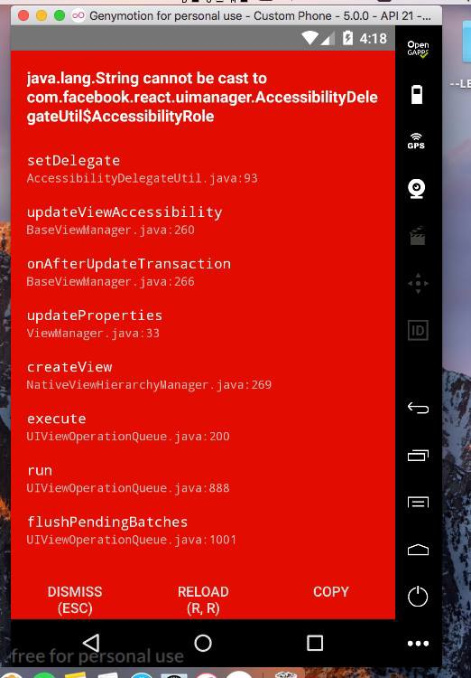

If you have done on it, let's add a new package which is `react-native-navigation` with command

```bash
npm add react-native-navigation
```

After that, we will run the app on an emulator to make sure our app running as well after we add that package. Here I use the iOS simulator iPhone 6.

```bash
react-native run-ios --simulator="iPhone 6"
```

And make sure it will look like this:


After the app runs as well on our simulator, and then we will configure it on each platform which is iOS and Android.

## iOS

First of all, we open our xcode and click _open another project_.

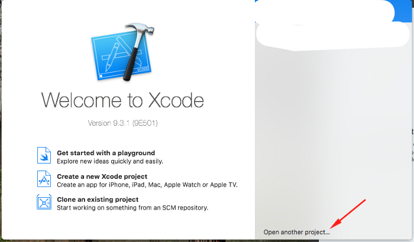

After opened, we will look at our repository that contained the package that we installed before and find a file with format _.xcodeproj_.

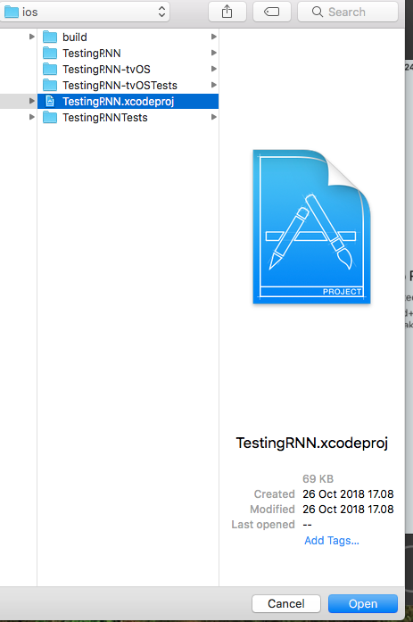

Again, make sure all are running as well.

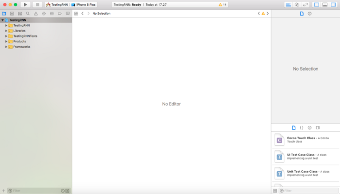

And then, right-click on the folder _Libraries_ and click _Add Files To "..."_

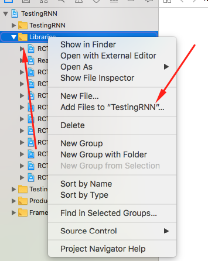

Next, choose file `ReactNaviteNavigation.xcodeproj` where it located at `./node_modules/react-native-navigation/ios` and choose the target is our app and then click _Add_, it will look like this:

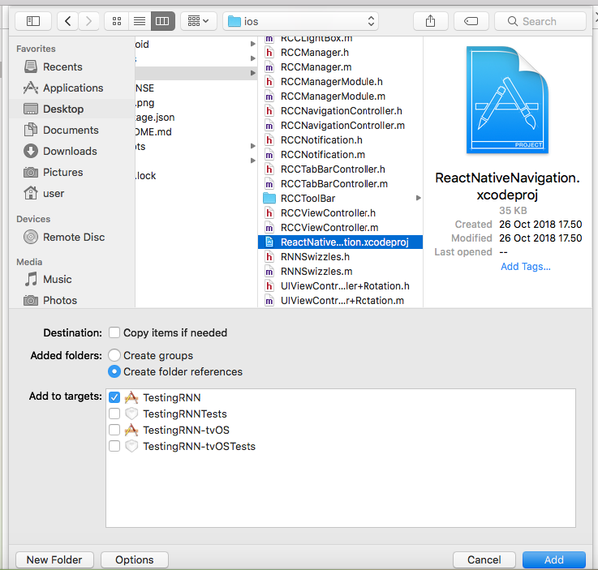

After we click to add that we should plug in RNN with our app by clicking our project

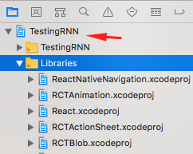

And then click on tab _Build Phases_ and then click _Link Binary With Libraries_ and it will look like this:


And also, we should connect RNN with our app thru button `+` and find _react native navigation_ and then find `libReactNativeNavigation.a` and then click the button _Add_

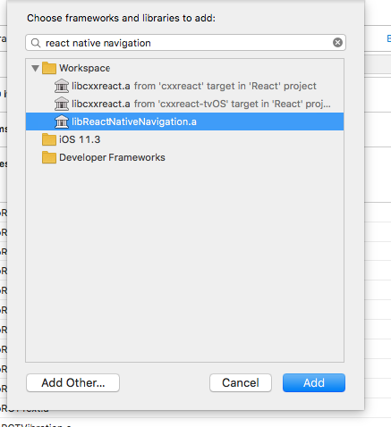

And also make sure `libReactNativeNavigation.a` already added and it will look like this:

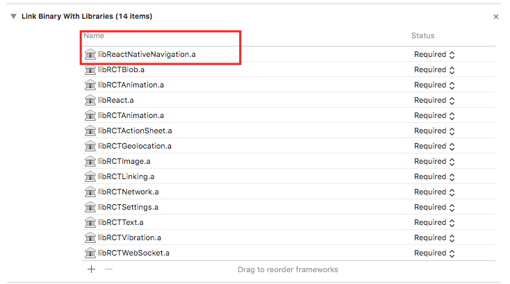

And yes, finally RNN is already connected with our app, do you think this is the final step on iOS? Nah, in the next step we should determine whether the library will run on the Native Thread or JS Thread itself, because we want to run on the Native Thread we should add this.

Focus on tab _Build Settings_ and find _"Header Search Path"_

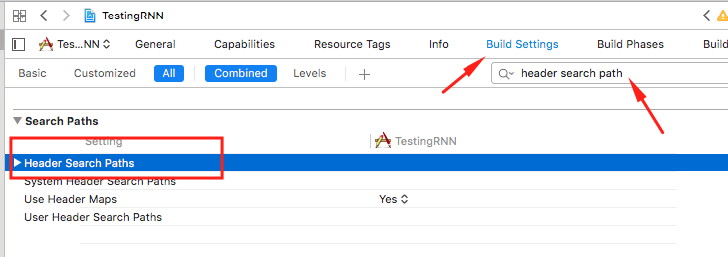

After that, double click, and then it will be showing a popup like this:

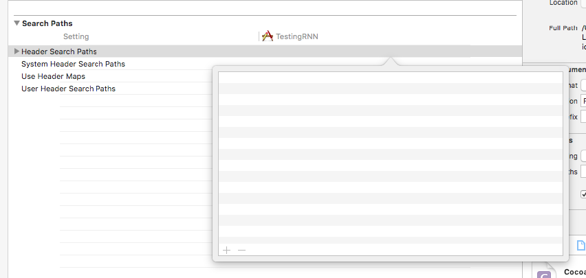

Ohh once again, if you struggled with opening a popup tip: "double click on the title instead of this section".

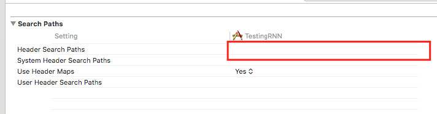

And then click button `+` and next add this path with type path `recursive`

```bash
$(SRCROOT)/../node_modules/react-native-navigation/ios
```

If already done on it, we will edit a file, and we will looks again the sidebar on the left side and find a file `AppDelegate.m` – that file is located under folder \__[our name app]_.

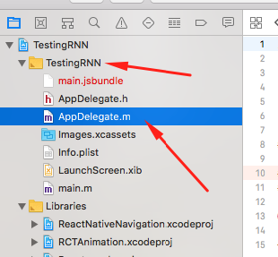

If already opened we will also open and edit within that in accordance with the file [this](https://github.com/wix/react-native-navigation/blob/master/example/ios/example/AppDelegate.m). When we change all the code within that then we will facing an error like this:


No problem it's good for us, we will fix it by opening Product -> Scheme -> Manage Scheme.

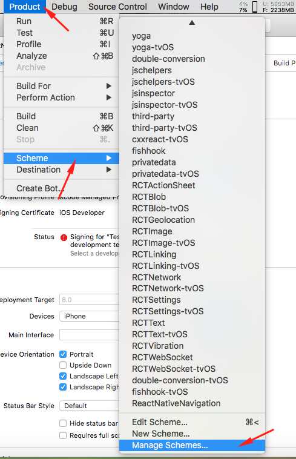

And then we will add React and if you already do it don't forget to checklist that like the others.

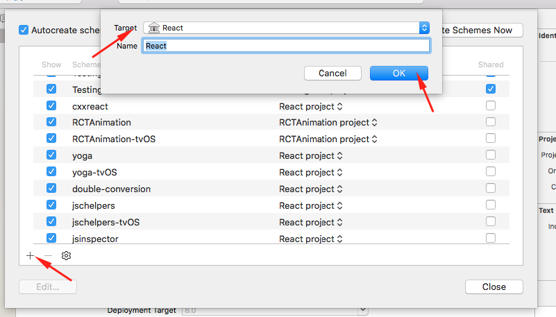

And goodbye error.

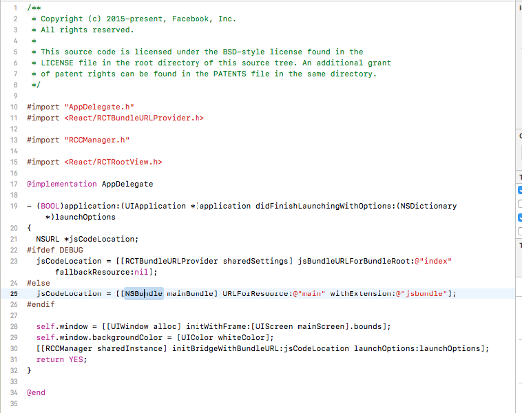

After that, we will re-build again our app and make sure our app will run as well.

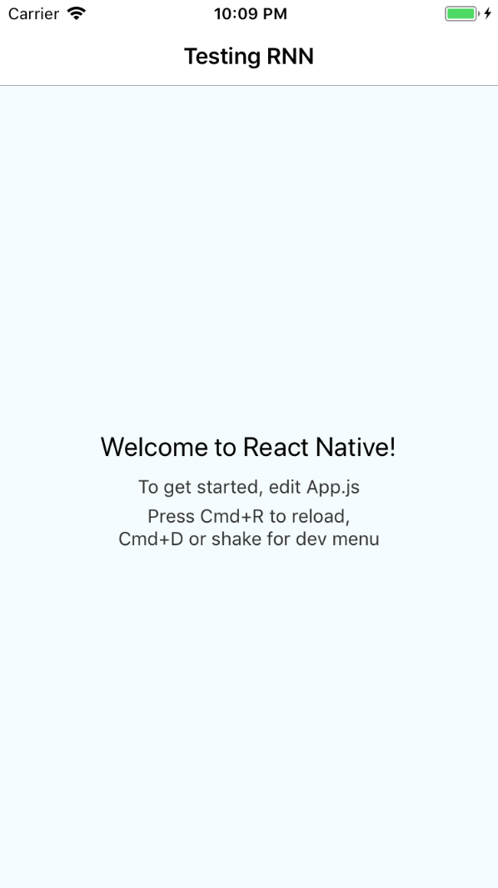

Okay then, our integration with platform iOS it's finished.

Thank you.
