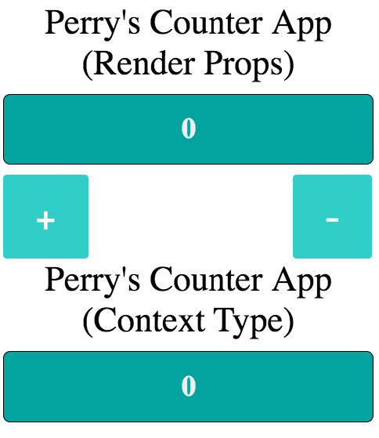
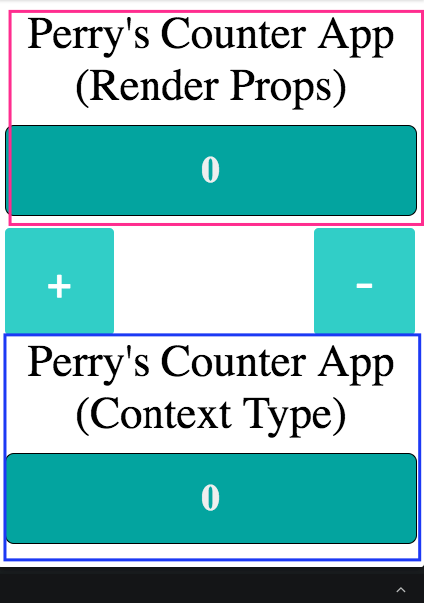

### TL'DR

Sebelum kita langsung ke context api saya curhat sedikit tentang “Kenapa Saya Belajar Context API?”. Jadi selama ini jika berbicara yang namanya state management pada react, saya selalu tertuju sama REDUX yang menurut saya ini keren banget untuk komunikasi component jika app yang kita gunakan sudah complex, masalahnya jika kita berhubungan sama redux kita harus siap — siap beruurusan dengan `switch-case` dan ini yang menurut saya pribadi **RIBET** untuk sekedar menyimpan sebuah data, tetapi ada sebuah helper yang namanya **Rematch** yang menurut saya pribadi ini juga keren banget, jadi kita tidak perlu berurusan dengan switch-case, tapi…. menurut saya masih susah juga walau hanya sekedar simpan data dan dipakai secara global, lalu saya menemukan sang pujaan hati si Context API. Sebenarnya dia ini sudah ada sejak React versi 16.3.0 (haduhh kenapa saya baru belajar sekarang), oke tanpa basa — basi lagi langsung mulai.

## I. Setup

Untuk setup project saya menggunakan [Codesandbox](https://codesandbox.io/), lalu didalamnya nanti kita akan membuat simple Counter untuk hasil finalnya bisa [kesini](https://codesandbox.io/s/n7rj5lxrzp).



## II. Pejelasan

### II.a

```jsx
let ContextType;
const { Provider, Consumer } = (ContextType = React.createContext());
```

Desctructing sebuah object dari `React.createContext()`, ada 2 tipe object yaitu `Provider` dan `Consumer`.

- Provider yaitu; sebuah component yang memungkinkan kita untuk men-subscribe sebuah context yang akan kita ambil, sebenarnya Provider ini memiliki sebuah props yaitu value nah props ini lah yang menentukan kita data apa saja yang akan di konsumsi oleh child-componentnanti (penjelasannya ada di fungsi render).
- terakhir ada `Consumer` kalau ini kita gunakan untuk mengambil sebuah data yang sudah di set di `props value` pada component `Provider` tadi, ada 2 cara untuk pengambilan value pada `Provider`
  - Render Props
  - class static type yaitu `contextType`, nah makanya kita membuat sebuah variable `let ContextType` karena `static contextType` itu isinya harus sebuah function `React.createContext()`

Untuk selanjutnya kita akan melihat sebuah component `statefull`

### II.b

```jsx
class ContextProvider extends React.PureComponent {
  state = {
    number: 0
  };

  addNumbers = () => {
    this.setState(({ number }) => {
      return {
        number: ++number
      };
    });
  };

  subtractNumbers = () => {
    this.setState(({ number }) => {
      return {
        number: --number
      };
    });
  };

  render() {
    return (
      <Provider
        value={{
          ...this.state,
          addNumbers: this.addNumbers,
          subtractNumbers: this.subtractNumbers
        }}
      >
        {this.props.children}
      </Provider>
    );
  }
}
```

Lihat pada lifecycle `render()` didalamnya saya me-return sebuah component `Provider` dimana saya sudah meng-isi data dari props `value` yang mana isi dari `value` itu adalah data — data yang akan kita pakai di component lainnya

Kalau kita lihat sejenak app kita, dimana disitu ada 2 title yaitu seperti ini


Diatas ada dua kotak, kotak yang atas kita mengambilnya dengan cara `Render Props` dan yang bawah dengan cara `Context Type`. Selanjutnya kita akan melihat bagaimana cara mengambil data tersebut.

## III. Mengambil Data Dari Provider

### III.a Dengan Render Props

Sekarang kita akan lihat bagaimana caranya mengambil dari dari value `Provider`, sekarang file yang terletak di `components/Header.js` dibagian atas file kita mengimport sesuatu dari file `context.js`

```jsx
import { Consumer, ContextType } from "../context";
```

ada dua yang kita ambil yaitu 1) Consumer dan 2) ContextType, untuk kasus ini kita akan menggunakan metode `render props` jadi kita hanya menggunakan `Consumer` saja, lalu jika kita lihat bawahnya ada sebuah function (stateless component) yang bernama `HeaderRenderProps`

```jsx
const HeaderRenderProps = ({ title }) => {
  return (
    <Consumer>
      {({ number }) => (
        <React.Fragment>
          <div id="header-title">Perry's Counter App (Render Props)</div>
          <div id="header-container">
            <h1>{number}</h1>
          </div>
        </React.Fragment>
      )}
    </Consumer>
  );
};
```

pada kode diatas kita hanya mengambil value dari `Provider` dengan cara **destructing object**, yaitu `number` jika kita mengintip file `context.js` maka kita akan melihat value dari component `ContextProvider` adalah seperti ini

```jsx
render() {
  return (
    <Provider
      value={{
        ...this.state, // ambil semua data dari state, lalu masukan ke dalam sini
        addNumbers: this.addNumbers, // ini sebuah fungsi
        subtractNumbers: this.subtractNumbers // ini sebuah fungsi
      }}
    >
      {this.props.children}
    </Provider>
  );
}
```

### III.b Dengan static contextType

Sekarang kita lihat dibagian paling bawah ada sebuah statefull component yaitu `HeaderContextType` kalau menggunakan statefull ini lebih mudah, hanya menambahkan ini saja pada component kita

```jsx{2}
class HeaderContextType extends React.PureComponent {
  static contextType = ContextType;

  ...
}
```

lalu kita lihat pada lifecycle `render()` kita bagaimana cara mengambilnya

```jsx{6}
render() {
  return (
    <React.Fragment>
      <div id="header-title">Perry's Counter App (Context Type)</div>
      <div id="header-container">
        <h1>{this.context.number}</h1>
      </div>
    </React.Fragment>
  );
}
```

kita lihat pada kode kita diatas cara menggunakannya hanya dengan cara `this.context.[nama yang mau kita ambil]` lalu tadaaa… data dari `Provider` sudah bisa kita gunakan.

## Kesimpulan

Sekali lagi saya menggunakan **CodeSandbox** dimana kalian bisa melihatnya [disini](https://codesandbox.io/s/n7rj5lxrzp), bagi kalian yang asing dengan apa itu `RenderProps` bisa langsung ke dokumentasi React-nya saja bisa [kesini](https://reactjs.org/docs/render-props.html), dan juga kalian masih kurang juga penjelesan tentang **Context API** kalian bisa [kesini](https://reactjs.org/docs/context.html).

Tulisan ini hanya sedikit apa yang saya pelajari saja, jika ada salah dalam penggunaan kata — kata mohon dimaklumi, Terima Kasih.
