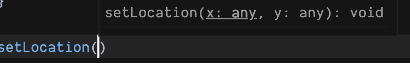
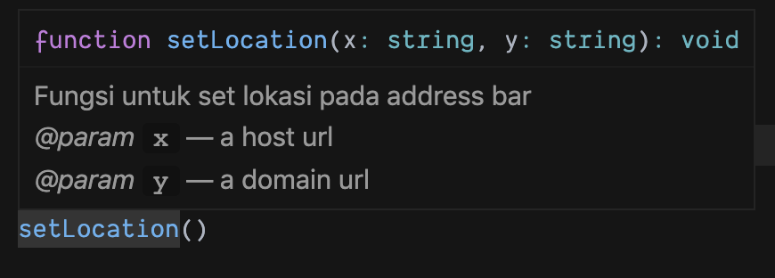
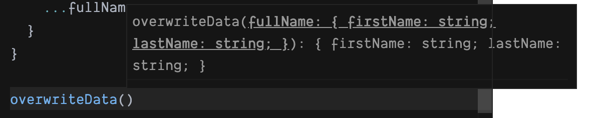
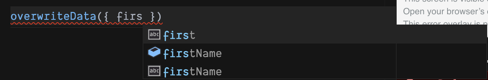

Berkomentar pada dasarnya ialah sebuah cara seseorang akan menilai sesuatu, entah itu dalam hal **baik** ataupun **buruk** dalam proses tersebut, kita akan tau, apakah kita akan memperbaiki atau meng-_improve_ sesuatu tersebut, sesuai dengan komentar yang diberikan.
\
\
Pada pembahasan kita kali ini, kita akan melihat seberapa penting-nya memberi sebuah komentar terhadap fungsi yang telah kita buat sendiri, tentu-nya pada JavaScript. Bayangkan kita mempunyai sebuah fungsi seperti ini

```js
function setLocation(x, y) {
  window.location.href = `${x}://${y}`;
}
```

Pada dasar-nya cara membaca sebuah fungsi ialah dari nama fungsi tersebut, yaitu: `setLocation` kita akan mengambil kesimpulan bahwa fungsi ini akan meng-_set_ sebuah _location_, tetapi pertanyaan _location_ apa? dan untuk apa? nah untuk selanjutnya kita akan melihat isi dari fungsi tersebut yaitu

```js
window.location.href = `${x}://${y}`;
```

Oh, ternyata fungsi tersebut ialah untuk meng-_set_ sebuah _location_ URL pada sebuah _address bar browser_ dengan catatan kita harus memasukan sebuah _arguments_ `x` dan `y`
\
\
Pertanyaan-nya `x` dan `y` itu apa sih? apakah kita bisa memasukkan sebuah `object`, `string` atau ada data khusus yang masukkan?, lain hal ketika kalian menggunakan TypeScript, pengecekan tipe data akan di lakukan oleh TypeScript pada saat _runtime_ atau saat _development_, jika kita menggunakan JavaScript?
\
\
Ya pada JavaScript (akan kita panggil JS kedepannya) _arguments_ pada fungsi `setLocation` akan di tampilkan oleh _intellisense editor_ sebagai `any` artinya apapun datanya ini bakalan di perbolehkan.



Permasalahan-nya fungsi yang kita buat ini akan dibaca oleh 2 sumber yaitu; **Komputer** dan **Manusia**, ketika kode dibaca komputer kode akan tetap dijalankan tidak peduli nama dari _arguments_ yang telah kita tetapkan, tetapi bagaimana dengan **manusia**?
\
\
Fungsi yang kita buat akan susah dipahami oleh developer selanjutnya (Manusia), karena tanpa tahu apa yang harus kirikan ke fungsi `setLocation`, lain halnya jika kita memberikan sebuah komentar

```js
// args `x` dengan type string, adalah sebuah protocol
// args `y` dengan type string, adalah sebuah domain name
function setLocation(x, y) {
  window.location.href = `${x}://${y}`;
}
```

Kode akan kita pahami dan akan kita gunakan sesuai dengan komentar yang diberikan, ini lebih baik dari pada sebelum-nya setidaknya kita paham apa yang harus di kirim kedalam fungsi yang kita buat.
\
\
Kita akan mencoba memberikan sebuah komentar pada fungsi yang kita buat, sesuai dengan _standard_ dari [JSDoc](https://jsdoc.app/), kita akan merubah komentar diatas menjadi seperti ini,

```js
/**
 * Fungsi untuk set lokasi pada address bar
 * @param {string} x a host url
 * @param {string} y a domain url
 */
function setLocation(x, y) {
  window.location.href = `${x}://${y}`;
}
```

Fungsi diatas yang telah kita ubah komentar-nya sesuai dengan dengan arahan [JSDoc](https://jsdoc.app/) berikan, ini akan lebih estetik, dan juga _intellisense_ pada editor akan muncul layaknya menggunakan TypeScript.



Tentu _intellisense_ hanya sekedar membantu untuk menentukan apa yang harus kita kirimkan, ketika kita menggunakan fungsi tersebut, bukan berarti _type strict_.
\
\
Hal ini sangat membantu apalagi kalau kita mempunyai sebuah fungsi dimana kita harusnya mengirimkan sebuah data object sebagai parameter fungsi tersebut, contohnya kita punya fungsi seperti ini

```js
/**
 * @param {object} fullName
 * @param {string} fullName.firstName your first name
 * @param {string} fullName.lastName your last name
 */
function overwriteData(fullName) {
  return {
    firstName: "Adib",
    lastName: "Firman",
    ...fullName
  };
}
```

Ketika kita hendak menggunakan fungsi `overwriteData` dia akan meminta sebuah parameter dengan isi-nya sebuah object, alih - alih kita membuka sumber asli dari fungsi tersebut untuk mengetahui isi object itu apa, kita sudah memberika sebuah komentar pada fungsi tersebut, ketika kita ingin menggunakannya



Seperti biasa _intellisense_ akan memberikan sebuah _hint_, dan juga yang paling menarik lagi ialah



Pada gambar diatas kita akan memasukkan sebuah data sesuai arahan dari _intellisense_ tentu saja kita akan mendapatkan sebuah _hint_ dari editor kita, menarik bukan?
\
\
Pertanyaan selanjutnya ialah, apakah semua fungsi yang sudah kita buat harus kita komentari? Tentu tidak, contoh fungsi seperti ini

```js
const sum = (firstNum, secondNum) => firstNum + secondNum;
```

Ketika kita ingin menggunakan fungsi tersebut, kita sudah tahu dari nama _argument_ yang diberikan, dan dari nama fungsi tersebut yaitu `sum` yaitu hanya menjumlahkan dua nilai.

## Kesimpulan

Memberikan komentar pada sebuah fungsi, tergantung bagaimana fungsi itu akan digunakan apakah _parameter_ yang diberikan sangat kompleks? ataukah sudah _readble_ dari pemberian nama fungsi dan _arguments_ yang dibuat?
\
\
Tetapi jika merasa fungsi itu perlu diberikan sebuah komentar, itu lebih baik, karena untuk memudahkan di _maintenance_ oleh developer selanjutnya (Manusia).
\
\
Terima Kasih
