Pada tahap ini saya akan melakukan cara instalasi pada _React Native Navigation WIX_, karena sering sekali gosip yang mencerikan kalau RNN ini susah sekali untuk di instal pada app kita, padahal ini semua sudah lengkap di kitab onlen RNN [(dokumentasinya)](https://wix.github.io/react-native-navigation/#/), sebelum tahap klimaks-nya saya akan menjelaskan jenis navigasi yang disediakan oleh **React Native**, yaitu:

- **Default Navigation**, \
  sebuah navigation yang disediakan default oleh RN itu sendiri, contoh-nya:
  - [Android](https://facebook.github.io/react-native/docs/navigator), ini sudah dihapus dari core RN itu semenjak versi ^0.45
  - [IOS](https://facebook.github.io/react-native/docs/navigatorios#docsNav), kabar baiknya ini masih di support sampai sekarang.
- **JS Navigation**
  sebuah navigation yang memang berjalan pada JS Core pada sebuah device, ini sebuah navigasi yang sering saya gunakan, contoh-nya:
  - [React Navigation](https://reactnavigation.org/)
  - [React Native Router Flux](https://github.com/RNRF/react-native-router-flux)
  - [React Native Simple](https://www.npmjs.com/package/react-native-simple-router)
- **Native Navigation Modules**
  navigasi yang memang memanfaatkan native thread itu sendiri, ada beberapa contoh yang bisa digunakan, contoh-nya:
  - [React Native Navigation Wix](https://wix.github.io/react-native-navigation/#/)
  - [Native Navigation (AirBnb)](https://github.com/airbnb/native-navigation/issues/114), seperti yang kita ketahui AirBnb sudah tidak menggunakan React Native lagi, soo package ini juga sudah depracated atau sudah _IS DEAD_ berikut [_Github Thread_](https://github.com/airbnb/native-navigation/issues/114)-nya.

nah pada sesi kali ini kita fokus ke **React Native Navigation Wix**, sebuah navigasi yang sering juga digunakan selain **React Navigation.**
\
\
Kenapa gak pake React Navigation aja, kenapa harus pake React Native Navigation Wix, apa perbedaannya?
\
\
pertanyaan ini yang sering menghantui saya sebelum pindah ke **React Native Navigation Wix**, yaa pertama ini karena jalan di Native Thread, jadi menurut saya ini akan membuat perform App kita akan semakin joss juga. Ada juga yang bertanya di Stackoverflow [Ini Thread](https://stackoverflow.com/questions/44147766/react-navigation-vs-react-native-navigation)-nya, jadi **React Navigation** itu gak masalah cuman untuk App skala besar pasti akan terasa performanya berkurang, dilihat dari banyak-nya JS yang di eksekusi itu akan memenuhi JS thread pada device user, jika user-nya low-end device maka ini akan menjadi masalah besar untuk kita. Langsung aja kita Capcusss…
\
\
Disini saya menggunakan **react-native-cli** _(bukan EXPO)_ untuk create project baru

```bash
react-native init TestingRNN --version="0.56.0"
```

kenapa saya pakai versi **0.56.0**? karena ini versi yang menurut saya minim bug, saya pernah coba install yang terbaru sekarang **0.57.4** ada error seperti ini

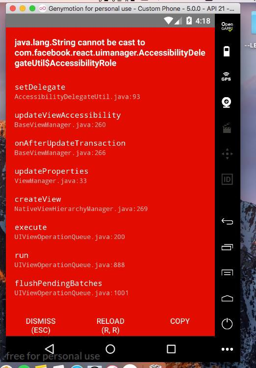

kalau sudah selesai langsung kita tambahkan package **react-native-navigation**, dengan perintah seperti ini

```bash
npm add react-native-navigation
```

setelah sudah ditambahkan, kita akan melihat versinya yaitu versi **1._._**, loh kenapa versi satu? bukannya sudah ada versi 2? karena versi 2 belum stable jadi kita cari aman aja 🙊. Setelah itu kita akan running app kita di emulator untuk memastikan app kita berjalan dengan lancar, disini saya menggunakan IOS simulator iPhone 6.

```bash
react-native run-ios --simulator="iPhone 6"
```

dan pastikan semua berjalan dengan normal


setelah semua berjalan dengan normal, lanjut kita akan configurasi pada masinng-masing platform.

## IOS

pertama kita buka xcode kita, lalu klik _open another project_

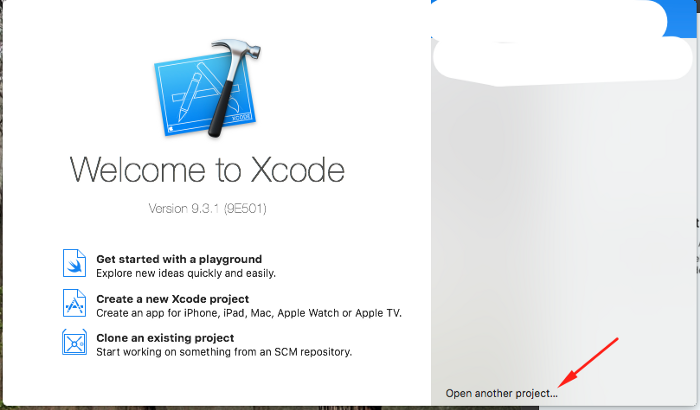

ketika sudah terbuka, kita cari repo app kita menuju ke folder IOS dan cari file yang berformar _.xcodeproj_

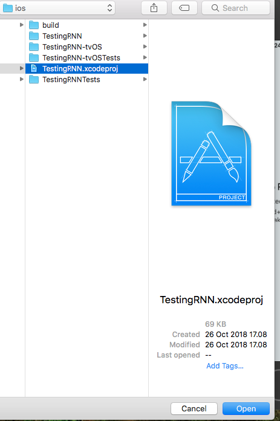

dan akan pastikan semua berjalan dengan normal

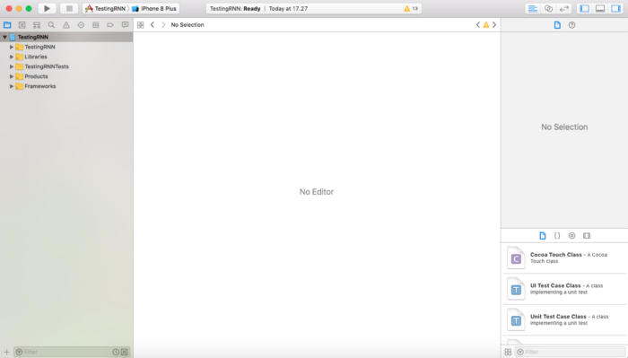

lalu lanjut klik kanan pada folder **Libraries**, dan klik **Add Files To “….”**

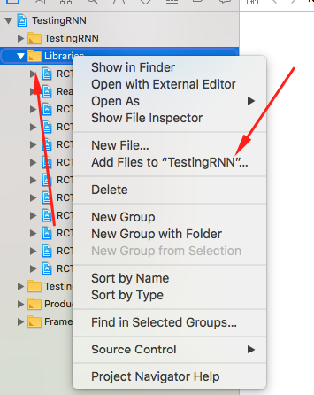

lalu pilih file **ReactNativeNavigation.xcodeproj** yang ada di `./node_modules/react-native-navigation/ios` dan targetnya adalah app kita lalu klik **Add**, terlihat seperti ini

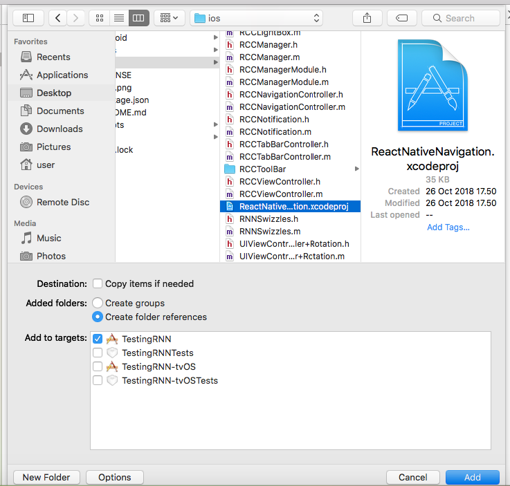

setalah klik add kita harus menyambungkan RNN dengan app kita, dengan cara, klik project kita

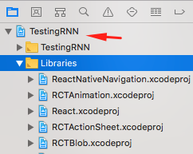

lalu masuk ke tab __Build Phases__ dan kita klik __Link Binary With Libraries__, akan terlihat seperti ini

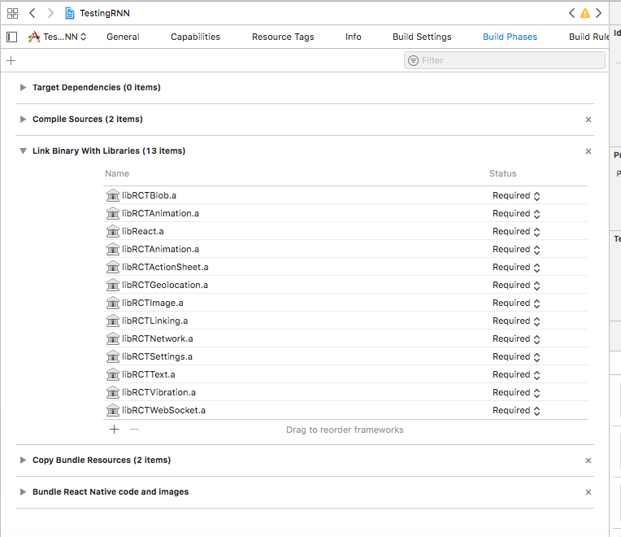

lalu kita kita sambung RNN dengan app kita, klik tombol `+`, dan cari __react native navigation__, lalu cari `libReactNativeNavigation.a` dan klik tombol __Add__


lalu pastikan juga `libReactNativeNavigation.a` berhasil kita tambahkan terihat seperti ini

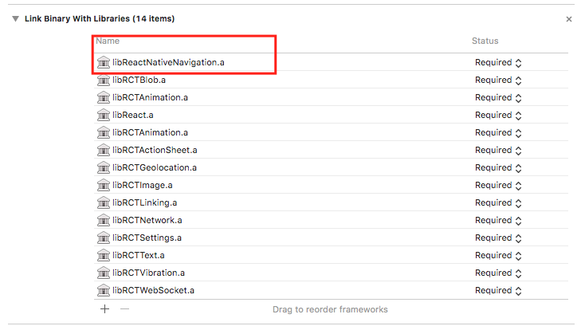

yaa akhirnya RNN telah tersambung dengan app kita, apa tahapan ini sudah selesai? aishh belum mas dan mbaee sekalian, oke lanjut. Step selanjutnya adalah yang menentukan apakah library mau dipanggil dari native thread apa JS thread itu sendiri, nah karena kita ingin dipanggil dari native thread, kita harus menambahkan ini. Masuk ke bagian tab __Build Settings__ lalu cari __“Header Search Path”__

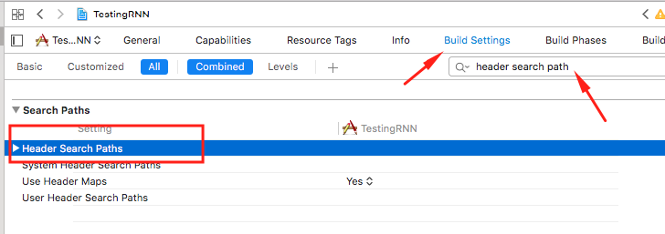

setelah itu klik dua kali, nanti akan muncul sebuah pop up seperti ini

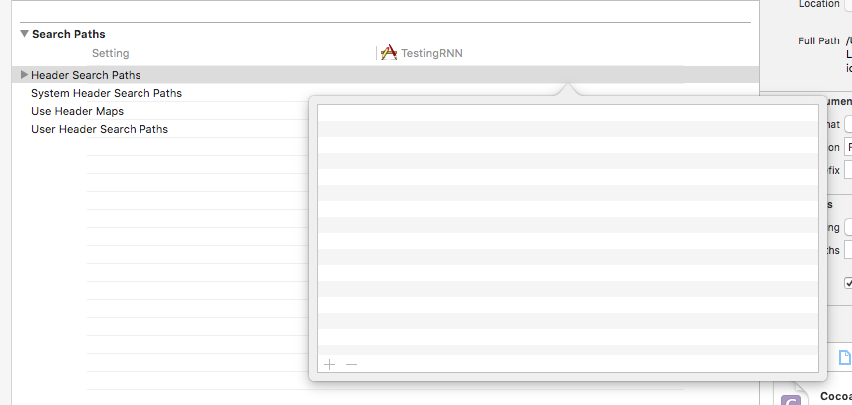

ohh iya bagi yang kesulitan untuk membuka popnya di klik dua kali jangan dibagian titlenya yaa tapi dibagian sini

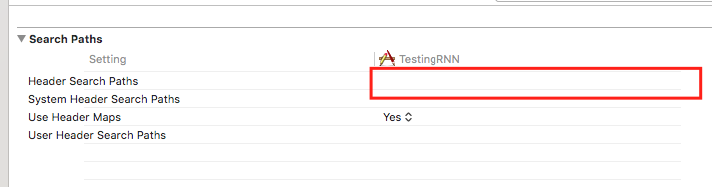

lalu klik tombol + lalu tambahkan path ini dengan tipe pathnya _recursive_

```bash
$(SRCROOT)/../node_modules/react-native-navigation/ios
```

jika sudah kita akan mengedit sebuah file, kita lihat lagi sidebar sebelah kiri lalu cari sebuah file `AppDelegate.m`, file tersebut terletak di bawah folder __[nama_app_kita]__


jika sudah terbuka kita akan buka dan edit didalamnya sesuai dengan file [ini](https://github.com/wix/react-native-navigation/blob/master/example/ios/example/AppDelegate.m).
Ketika kita ubah semua kode didalamnya maka kita akan mendapatkan error seperti ini

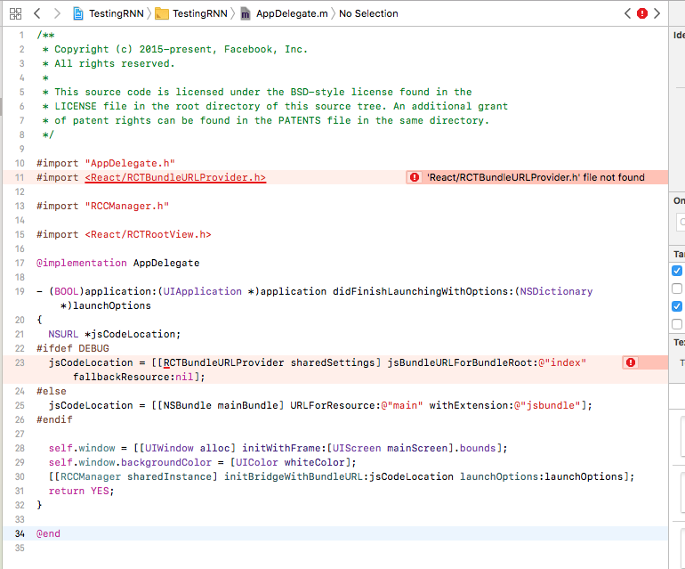

no problem sob kita akan memperbaikinya buka __Product -> Scheme -> Manage Scheme__

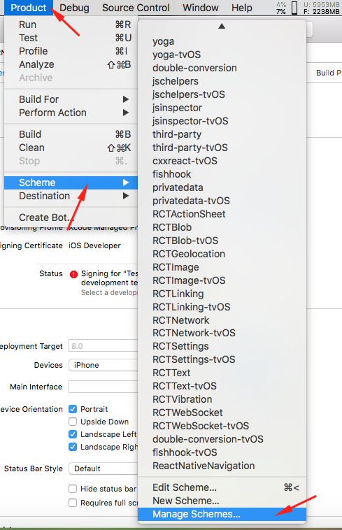

lalu kita akan tambahkan React seperti ini, dan jika sudah ditambahkan jangan lupa untuk di ceklis yaa

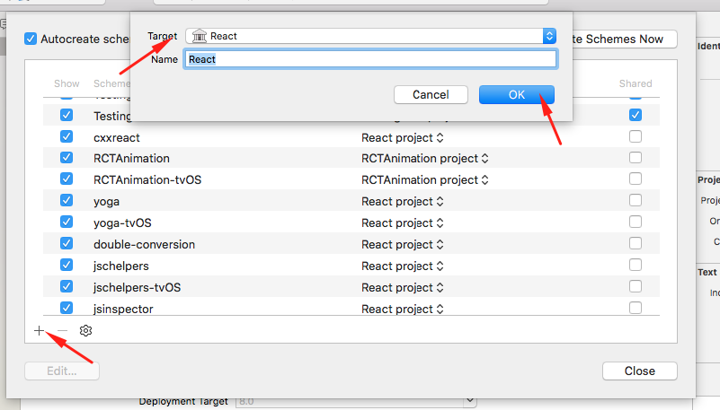

lalu bye bye error

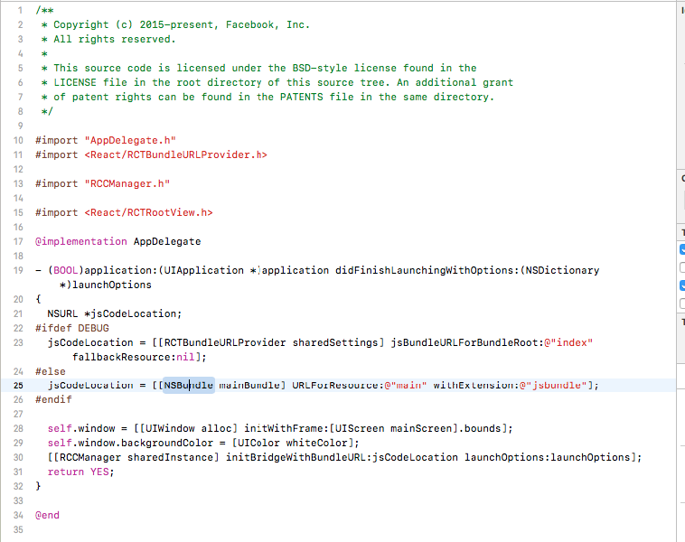

dan kita re-build lagi app kita, dan pastika juga aplikasi berjalan dengan lancar

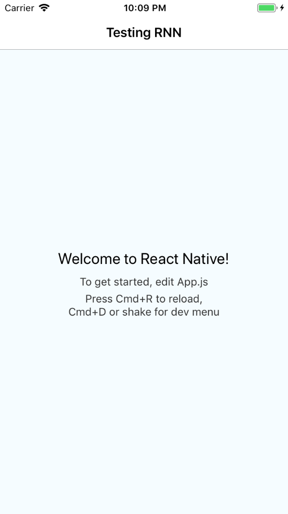

oke integrasi pada platform IOS sudah selesai, lanjut kita ke Android

## ANDROID

disini saya akan menggunakan android studio untuk mengubah native codenya, ini hanya optional saja jika masih ingin menggunakan editor yang sama tidak masalah. Pertama buka file `Android/settings`.gradle lalu tambahkan ini

jika sudah lanjut kita akan mengedit file `Android/app/build.gradle` lalu scroll kebawah dan lihat pada bagian __depedencies__ tambahkan ini didalamnya

jika sudah kita akan mengubah file lagi di `Android/app/src/main/java/com/testingrnn/MainActivity.java` jika sudah buka file tersebut dan ubah menjadi seperti ini

nahh untuk tahap akhir pengeditan masih di path yang sama buka file __MainApplication.java__ ubah semuanya seperti ini

okeee untuk semua persiapan di android sudah kita lakukan, lanjut kita build app kita dengan cara seperti biasa `react-natve run-android` jika sudah maka kita akan lihat hasilnya seperti ini


mantap betul guyss, lanjut kita akan testing juga cara navigasi pada RNN, nah navigasi pada RNN ini menurut saya gampang banget. Duplikat saja file `App.js` lalu jika sudah di duplikat maka kita register filenya `index.js` contoh seperti ini

```js
import App from './app'
import NewApp from './NewApp'

// register screen
Navigation.registerComponent(appNamem () => App)
Navigation.registerComponent('NewApp', () => NewApp)
```

terlihat code dimana kita menggunakan `Navigation.registerComponent` ini digunakan untuk mendaftarkan sebuah screen baru, nah didalamnya terdapat 2 parameter, yaitu:

- __uniqueID__: ini istilahnya adalah nama unik screennya, jadi ini nanti fungsinya jika kita ingin pindah ke screen ini, kita harus panggil uniqueID ini.
- __generator__: ini harus berupa function, jadi bisa dibilang ini kita manggil filenya didalam sini, code diatas saya menggunakan import terlebih dahulu, jika kalian tidak ingin seperti itu bisa langsung panggil filenya dengan cara `require(./App).default`

jika sudah kita daftarkan selanjutnya buka file App.js kita akan membuat sebuah button, dan didalamnya kita masukkan props onPress yang isinya seperti dibawah ini

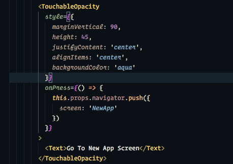

oke kita fokus pada props `onPress` saja, nah disitu kita panggil `this.props.navigator` dimana props navigator ini sudah otomatis ada karena kita tadi sudah mengregisterkan file `App.js` kita. Lalu pada props `navigator` ada sebuah fungsi yang bernama push dimana fungsi ini berguna untuk pindah dari screen satu menuju screen lainnya jika kurang jelas bisa liat [dokumentasinya](https://wix.github.io/react-native-navigation/docs/before-you-start/)

nah jika sudah maka hasilnya akan seperti ini

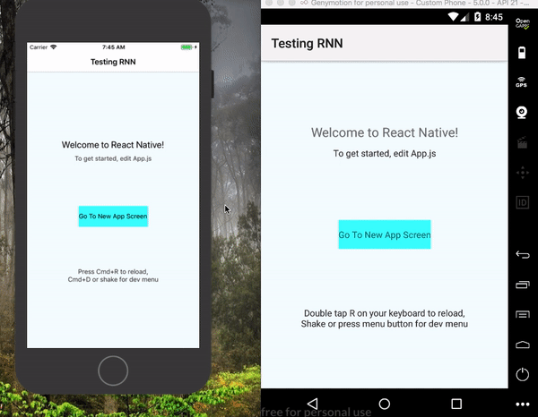

pada kesempatan ini kita hanya sampai sini dulu, next kita akan mengintegrasikan dengan redux dan redux persist pada navigasi kita.
\
\
Terima Kasih
