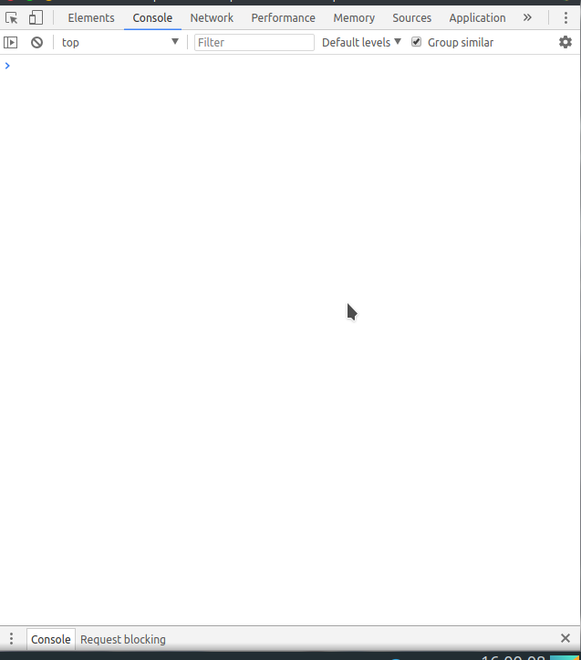

Sebenarnya judulnya sih agak _lebay_, cuman ada benarnya juga kenapa kita bilang dia sicantik-nya Javascript, oke langsung saja kita perkenalan dengan dia, beeerrraanggkaattt…..

---

## 1. Tentang Si-Cantik

**ES6** kepanjangan dari ECMAScipt 6, yang merupakan evolusi dari javascript yang dikembangkan oleh TC39 (Ecma Technical Commite 39), sebenarnya kenapa saya bilang sicantik yaa memang dia ini memudahkan kita untuk membaca kode javascript, yang saya tau pada saat pertama kali saya belajar javascript memang agak susah dibaca (mungkin saya doank kali ya), lalu apa sih tujuannya?

## 2. Tujuan Mengenal Si-Cantik

sebenarnya apa sih tujuannya? lah kan javascript biasa aja bukannya udah cukup tuh?, memang sudah cukup, cuman penulisannya yang agak kurang modern (jadul) aja kalau menurut saya, nah dengan hadirnya **ES6** maka kita akan meng-improve kode javascript kita, contohnya:

1. Class
2. Modules
3. Arrow Function
4. Penamaan Parameter dari Function
5. dan masih banyak yang lainnya

dari pada kita panjang lebar menjelaskan langsung kita mulai pembelajaran Mengenal **ES6**.

## 3. Say “HI” Sama Si-Cantik

Dibagian ini kita akan mengenal lebih dalam lagi dengan si cantik **ES6**, fitur-fitur di **ES6** ini sendiri sebenarya mudah untuk kita adopsi langsung, bila kalian ingin langsung mencoba-coba fitur ini, silahkan buka developer tools pada browser kalian masing masing, disini saya menggunakan **Google Chrome**, pada chrome sendiri bisa menekan `ctrl + shift + i` jika sudah maka tampilannya akan seperti ini



---

## I. Migrasi dar **var** Ke **let** atau **const**

Biasanya kita mendeklarasi sebuah variabel menggunakan `var`, nah didalam `ES6`, kita ada sebuah pilihan cara mendeklarasi sebuah variabel yaitu dengan `let` atau `const`. Lalu apa sih bedanya? pertama-tama kita akan membahas `var`

```jsx
var x = 3;
function func(getRandomNum) {
	if (getRandomNum) {
		var x = 10;
	}

	return x;
}

console.log(func(false)); // undefined
```

kenapa bisa keluar `undefined`, karena variabel `var` ini cakupannya adalah sebuah function atau bisa dibilang `function-scope` lain cerita jika kita mendeklarasinya seperti ini

```jsx{4}
var x = 3;
function func(getRandomNum) {
	if (getRandomNum) {
		x = 10; // remove 'var'
	}

	return x;
}

console.log(func(false)); // 3
```

ini memang berhasil keluar angka `3`, tetapi `var x` mendeklarasikan sebuah `global-scope` artinya apa? artinya jika `var x` di deklarasikan lagi setelah fungsi `func`, maka dia akan memakai pendeklarasian yang ter-akhir, dan ini menurut saya tidak dianjurkan, oke kita lanjut ke `let`. Kita akan memakai fungsi yang sama tetapi kita ganti dengan `let`

```jsx
let x = 3;
function func(getRandomNum) {
	if (getRandomNum) {
		let x = 10; // remove 'var'
	}

	return x;
}

console.log(func(false)); // 3
```

ketika kita mengganti-nya dengan `let`, langsung bisa terlihat bahwa kita akan meihat angka 3, berbeda dengan `var` yang mengeluarkan sebuah undefined, kenapa bisa demikian? karena `let` cakupannya adalah sebuah block `{…}` atau sebutannya `block-scope`, yang berarti cakupannya hanya didalam block itu sendiri. Lalu bagaimana jika kita mendeklarasikan `let x` lagi dibawah fungsi `func`?

```jsx
let x = 3;
function func(getRandomNum) {
	if (getRandomNum) {
		let x = 10;
	}

	return x;
}

let x = 10;

console.log(func(false)); // Error: indentifier 'x' has alread been
```

kita akan mendapatkan sebuah error, dimana errornya bahwa _“coy, si X ini udah di deklarasiin sebelumnya”_ ini yang saya suka, kenapa? karena let ini setia, jadi sekalinya di deklarasikan maka dia akan tetap memakai deklarasi yang pertama kali. Lanjut kita akan mencoba si `const`

```jsx
const x = 3;
function func(getRandomNum) {
	if (getRandomNum) {
		const x = 10;
	}

	return x;
}

console.log(func(false)); // 3
```

sebenarnya const ini sendiri tidak jauh berbeda juga dengan si `let` dia juga setia kok, tetapi `const` ini harus di-inisialisasi dulu isinya, maksudnya apa? contoh seperti ini

```jsx
const abc // Error: Missing initializer in const declaration
```

kita akan mendapatkan sebuah error dimana isinya “coyy, const ini kagak ada isinya, lu harus isi dulu” jadi const ini harus mempunyai sebuah `default value`, tidak seperti `let` atau `var` yang bisa di deklarasikan seperti itu tanpa `default value`, dan juga `const` tidak bisa mengganti nilai yang sudah di deklarasikan, contohnya

```jsx
const abc = 123;
abc = 321; // Error: Assignment to constant variable
```

sudah jelas bukan? jadi nilai dari const ini harus tetap, sooo menurut saya

- Pilih `const` jika nilai tidak berubah-ubah
- Pilih `let` jika ada perubahan nilai
- Jauhi `var`

> Karena banyaknya penjelasan tentang ES6 saya tidak mungkin menulisnya sekaligus. Kita akan melanjutkannya di part selanjutnya.

Oke semuanya sekian dulu dari saya jika ada kesalahan dalam penjelasan mohon maaf, karena manusia tidak luput dari kesalahan. Terima Kasih
