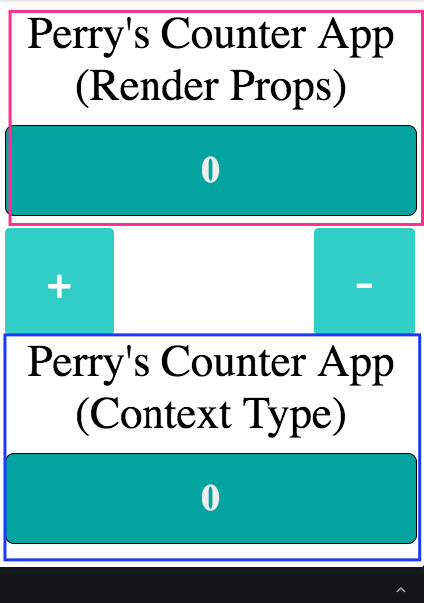

## Introduction

Before we jump into the main topic I just want to tell a story about "Why I learned Context API". So, if we talked about state management in React, we always focused on _Redux_ which I thought it's totally cool right? we can communicate directly with the component in case our app it's kinda huge.

The problem with the redux is we should prepare ourselves to understand the _switch-case_ problem and I thought it was kinda hard to read it when we just put a simple value.

But, there's a package called _Rematch_, in my opinion, it's cool because we don't need any more complicated cases with _switch-case_. In my opinion again this package it's kinda bloated if we want to put a simple value we need to install that package first and integrate it with our app.

That's why I found a new API from React which is _Context API_. Actually, this API was already released in version 16.3.0, without further ado let's dig into this API.

## I. Setup

To set up my project I will use [Codesandbox](https://codesandbox.io/), then within that project, we will create a simple Counter App, you can check the result of the app [in here](https://codesandbox.io/s/n7rj5lxrzp).


## II. Explanation

### II.a

```jsx
let ContextType;
const { Provider, Consumer } = (ContextType = React.createContext());
```

According to that code, we should destruct an object from `React.createContext()` – there are 2 type of object which is `Provider` and `Consumer`

- `Provider` is: a component that determined and used to subscribe to a context/value where we want to use it, actually, this variable has a prop that is `value` this prop will make sure what are the value will be provided to another component under this component like (tree-component).
- `Consumer` is: we will use it when we want to get a value that already passed from `Provider`, there is two way to get a value:
  - Render Props
  - Static class type that is `contextType` according to that app that's why we have a variable `let ContextType` which is `static contextType` has a value from function `React.createContext`.

For the next part, we will see a `statefull` component getting a value from Context.

### II.b

```jsx
class ContextProvider extends React.PureComponent {
  state = {
    number: 0,
  };

  addNumbers = () => {
    this.setState(({ number }) => {
      return {
        number: ++number,
      };
    });
  };

  subtractNumbers = () => {
    this.setState(({ number }) => {
      return {
        number: --number,
      };
    });
  };

  render() {
    return (
      <Provider
        value={{
          ...this.state,
          addNumbers: this.addNumbers,
          subtractNumbers: this.subtractNumbers,
        }}
      >
        {this.props.children}
      </Provider>
    );
  }
}
```

As you can see on the lifecycle `render()` within that I'm returning a component `Provider` which is I already fill in from props `value` which is the value from that prop is a data that we want to use it on another component under `Provider`.

If we take a look at our app for a while, where we have two titles that are:



According to the image above, there are two boxes. For the _Red Box_ we will get all the values with type _Render Props_ and for the _Blue Box_ we will get it with the _Context Type_ method, Next, we will see how we implement it.

## III. Getting a data from `Provider`

### III.a With _Render Props_

Now, we will look at how we get data from `Provider` on a file that is located on `components/Header.js` in top of that file we import something from file `context.js`.

```jsx
import { Consumer, ContextType } from "../context";
```

There are two variables that we need `Consumer` and `ContextType`. For this case, because we will use method _Render Props_ so we just need `Consumer` only then, if we take a look at the bottom of the file there's a function (stateless component) named `HeaderRenderProps`.

```jsx
const HeaderRenderProps = ({ title }) => {
  return (
    <Consumer>
      {({ number }) => (
        <React.Fragment>
          <div id="header-title">Perry's Counter App (Render Props)</div>
          <div id="header-container">
            <h1>{number}</h1>
          </div>
        </React.Fragment>
      )}
    </Consumer>
  );
};
```

On that code, we just get a value from `Provider` by _destructuing object_ which is _number_ if we peeking from file `context.js` we will see a value from component `ContextProvider` like this:

```jsx
render() {
  return (
    <Provider
      value={{
        ...this.state, // Get all from state and then put it on this
        addNumbers: this.addNumbers, // this is a function
        subtractNumbers: this.subtractNumbers // this is a function
      }}
    >
      {this.props.children}
    </Provider>
  );
}
```

### III.b With method `static contextType`

If we take a look at the bottom of the file there's a _statefull_ component called `HeaderContextType` in fact, this way is easier than before, we just add this code to our component:

```jsx
class HeaderContextType extends React.PureComponent {
  static contextType = ContextType;
  ...
}
```

And then, we take look at the lifecycle `render()` and how we get the data:

```jsx{6}
render() {
  return (
    <React.Fragment>
      <div id="header-title">Perry's Counter App (Context Type)</div>
      <div id="header-container">
        <h1>{this.context.number}</h1>
      </div>
    </React.Fragment>
  );
}
```

If we take look at that code, how do we get the data just declaring this `this.context.[the name what kind of data that we want to use]` – and then voilaaa.... the data from `Provider` we can easily get it.

## Conclusion

Gentle reminder I'm using _Codesandbox_ which is you can take look on [here](https://codesandbox.io/s/n7rj5lxrzp), if you struggled with what is _RenderProps_ you can directly go into the documentation React [here](https://reactjs.org/docs/render-props.html) also if you kinda miss understood about _Context API_ you can directly go into the official documentation React [here](https://reactjs.org/docs/context.html).

This article is only a little of what I have learned, Thank you.
