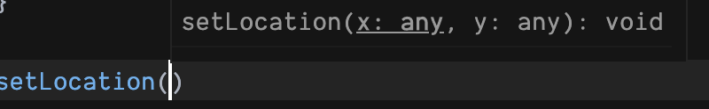
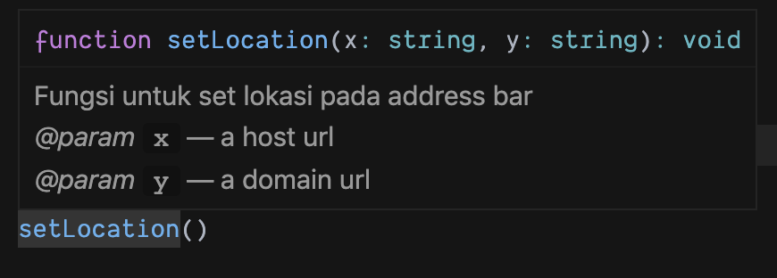
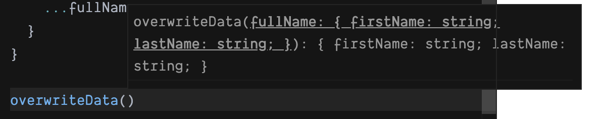
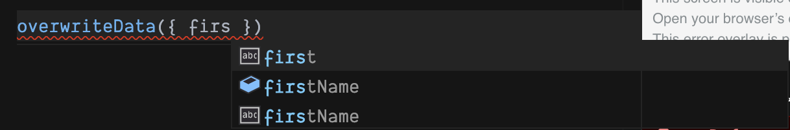

## Introduction 

Commenting is basically a way for someone to judge something, whether it's in terms of **good** or **bad** in the process, we will know whether we will improve or improve something, according to the comments given.
\
\
In our discussion this time, we will see how important it is to comment on a function that we have created ourselves, of course in JavaScript. Imagine we have a function like this

```js
function setLocation(x, y) {
  window.location.href = `${x}://${y}`;
}
```

Basically, how we read a function in JS just directly what function name that has been provided, in our case on above we named it as `setLocation` we will conclude that function will set a new location, but what kind of location? what the purpose for? in below we will try to understang bit-by-bit to knowing better that function.

```js
window.location.href = `${x}://${y}`;
```

Oh, turns out that function will be execute a _location_ of URL at address bar browser something like that, with note we should fill in some _arguments_ `x` and `y`.
\
\
What's The explanation of arguments `x` and `y`? whether we will can fill in `object` or `string` or maybe we can fill in some special input? another we use Typescript, the type data mechanism will be done by Typescript itself on _runtime_ or maybe on _development_, but how about we use JavaScript?
\
\
Yes, in JavaScript (we will call it JS in the future) the _arguments_ in the `setLocation` function will be displayed by the _intellisense editor_ as `any` meaning whatever the data is will be allowed.



The problem is that the function we created will be read by 2 sources, namely; **Computer** and **Human**, when the code is read by the computer the code will continue to run no matter the \_argument name we have set, but what about **human**?
\
\
The function we create will be difficult for the next developer (Human) to understand, because without knowing what to send to the `setLocation` function, it's different if we leave a comment

```js
// args `x` with data type string, is a protocol
// args `y` with data type string, is a domain name
function setLocation(x, y) {
  window.location.href = `${x}://${y}`;
}
```

We will understand the code and we will use it according to the comments given, this is better than before, at least we understand what to send into the function we create.
\
\
We will try to comment on the function we created, according to the _standard_ of [JSDoc](https://jsdoc.app/), we will change the above comment to something like this,

```js
/**
 * A function that can be executed on address bar browser
 * @param {string} x a host url
 * @param {string} y a domain url
 */
function setLocation(x, y) {
  window.location.href = `${x}://${y}`;
}
```

The above function that we have modified the comments according to the [JSDoc](https://jsdoc.app/) directive provided, this will be more aesthetic, and also _intellisense_ in the editor will appear like using TypeScript.



Indeed, _intellisense_ it's just can help use to determine what should be send in that function, when we want to use that, but it's not totally _type strict_
\
\
This is very helpful especially if we have a function where we should send a data object as a parameter of the function, for example we have a function like this

```js
/**
 * @param {object} fullName
 * @param {string} fullName.firstName your first name
 * @param {string} fullName.lastName your last name
 */
function overwriteData(fullName) {
  return {
    firstName: "Adib",
    lastName: "Firman",
    ...fullName
  };
}
```

When we want to use the `overwriteData` function it will ask for a parameter with the contents of an object, instead of opening the original source of the function to find out what the object is, we have put a comment on the function, when we want to use it



Alike usual _intellisense_ will give us a hint, and you know that the more insteresting for this approach is;



In the picture above we will enter data according to the instructions from _intellisense_ of course we will get a _hint_ from our editor, interesting isn't it?
\
\
The next question is, should we comment on all the functions that we have created? Of course not, an example of a function like this

```js
const sum = (firstNum, secondNum) => firstNum + secondNum;
```

When we want to use the function, we already know from the given _argument_ name, and from the function name it is `sum` which only adds up two values.

## Conclusion

Commenting on a function, depending on how it will be used are the given parameters _very complex_? or is it _readble_ from naming function and _arguments_ created?
\
\
But if you feel that the function needs to be given a comment, that's better, because it is to make it easier to maintain by the next developer (Human).
\
\
Thank you.
