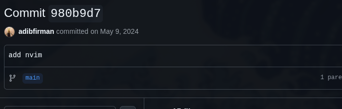

# The Problem

My setup was pretty simple: macOS at the office and Arch Linux at home.
But one recurring problem kept slowing me down, and it is my daily driver editor, which is VS Code.
As much as I liked it, the editor was resource-hungry, eating up CPU and memory,
especially with Node.js projects, and also because I had to constantly jump between the keyboard and the mouse
which made my hands sore due to this, it's broken my pace of coding, I'm just telling this because it's
happened to me, if you not, then glad to hear that.

 
So, let me try to recap first what kind of issue I had before:

- VSCode eats so much memory, and you can imagine if you open alongside Chrome Dev Tools too :)
- Cross-OS issue editor, like you know the difference between cmd and ctrl
- My hands somehow got sore due to jumping between the mouse and the keyboard

For the last issue, I think it's just a skill issue; it seems I just can
register the keyboard shortcut in VSCode.

# The journey to find you (Neovim)

To solve the rest of the issue that I had, there is a thing that came to my mind:

> Does VSCode support keyboard layouts or mapping them based on JSON?

I'm figuring it out on the documentation and found this [this resource](https://code.visualstudio.com/docs/configure/keybindings)
but still, there are several cases in VSCode where you cannot totally change it because it's
link with the OS itself, you need to accept, and cannot change that behavior.

## A destiny perhaps(?)

Still in the same issue that I had, in between, I find several folks on the X platform (formerly Twitter)
talking about Neovim and several YouTube recommendations coming like "Here's the reason why you need
to use Neovim, etc, etc. It makes me curious about it.

 
After the research on the internet, I found several battery-included articles about Neovim, such as:

- [NvChad](https://nvchad.com/)
- [LunarVim](https://www.lunarvim.org/)
- [AstroNvim](https://astronvim.com/)
- [LazyVim](https://www.lazyvim.org/)

I'm not sure if there's anything more besides what I mentioned above, but I've tried those and I'm falling in love
with the LazyVim instead, the reason is only that "the keymaps" are nearly the same as I have in VSCode.
Because, at that time, I didn't know yet how to set up my keymaps in Neovim, so I just tried it one by one and "voila"
found the Lazyvim.

So I guess all the issues that were mentioned above have been resolved, right? right?

## Learning curve

It's not as easy as I think, to be honest, it's really hard to start because you have a different keyboard,
UI and etc, like it's a totally different world, but I have an answer for this, so instead of testing it.
on a side or personal project, I jumped straight into using it at work, which meant I had to adapt quickly,
so just like adding more pressure helped me learn faster.

 
Along the way, I also started learning Lua, the scripting language that powers neovim configuration and start
to change the keymaps that come from Lazyvim and write my own small functions and tweak configs
that it feels gave me a sense of _control over my editor._

 
Another game-changer for me was learning how to use [macros](https://neovim.io/doc/user/usr_10.html).
Instead of repeating the same actions for your code over and over, I could record a sequence once and
replay it as many times as needed. This drastically improved my speed when editing repetitive code patterns.

 
The last one is one of the biggest turning points, which was understanding what LSP (Language Server Protocol) and
Treesitter could do. LSP brought several IDE features such as auto-completion, go-to definition,
and inline diagnostics, while Treesitter made syntax highlighting and code navigation much more
reliable. Together, they made Neovim feel modern and powerful.

 
It feels like I know the under-the-hood of the IDE built-in after I use Neovim.

## Boring or maybe too much

Day by day, when I still use lazyvim-battery-included to use Neovim, it feels like there are several plugins
and keymaps that I really don't want to use yet, so I'm just thinking that

> "How about I build it from scratch?"

I know it feels like I try to enter the unknown area, haha, but in my heart, I say "build it or lose it".

 
So, I just started to build my own config for Neovim, turns out there are two types of packages from Lazyvim:

- [The battery-included package](https://www.lazyvim.org/)
- [The plugin manager](https://github.com/folke/lazy.nvim)

At first, I was a bit confused about the difference between Lazy.nvim and LazyVim.org. Lazy.nvim
it is actually a plugin manager; it helps install and manage other plugins. Meanwhile, LazyVim.org
is a full Neovim distribution built on top of Lazy.nvim, with lots of defaults and plugins preconfigured, feels like battery-included, right?
So, to build it from scratch, I decided to go with the bare plugin manager, so I could understand
what was going on under the hood.

 
I keep my plugin list minimal, installing only the tools I really need. This made my Neovim feel lightweight.
As I grew more confident, I tried to write my own keymaps, autocmd, etc. This was the moment when the editor.
truly felt personal.

# And here we go

Nowadays, my Neovim workflow no longer follows my old VSCode config; I just feel more confident.
Moving from VSCode to Neovim turned out to be way more than just switching editors.
I went from copying configs and struggling with defaults to building my own setup piece by piece.

 
Learning Lua, figuring out LSP and Treesitter, and keeping my plugins lean really shaped how I
use the editor. At some point, I stopped comparing it to VSCode, and Neovim became its own thing for me.
And once I started writing my own keymaps, that’s when it finally felt like home. You can check my own [dotfiles in here](https://github.com/adibfirman/dotfiles).

Thanks for reading the story.
