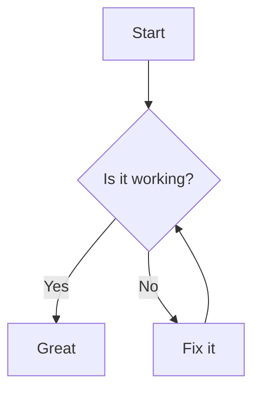

# Markdown Torture Test

> A single, brutal markdown file to exercise **many** features and edge cases. Use it to validate parsing, rendering, and extension support.

---

## Headings

# Setext H1

## Setext H2

# ATX H1

###### ATX H6 (smallest)

Some text directly under a heading without a blank line.

## Paragraphs & Emphasis

Plain paragraph with *italic*, **bold**, and ***bold-italic***. Also ~~strikethrough~~ and <u>underline (HTML)</u>. Emoji shortcodes \:sparkles: should render if supported.

This paragraph has smart punctuation — en–dash, em—dash, and “curly quotes”.

This paragraph ends with a hard line break.
This sentence should appear on a new line.

## Inline Code & Escapes

Inline code: `console.log("hello( ) [ ] { } * _ ~ \` ")` and a backtick within code: `` `like this\` \`\`.

Literals: \*asterisks\*, \_underscores\_, $brackets$, $parens$, #hash, \backslash, \`backtick\`.

## Links

Inline link: [OpenAI](https://openai.com "OpenAI home").

Reference link: [CommonMark][cm] and duplicate label case-insensitive: [commonmark][CM].

Autolink: [https://example.com](https://example.com), and email: [test@example.org](mailto:test@example.org).

URL with parens: [RFC 3986](https://datatracker.ietf.org/doc/html/rfc3986#section-3.2.2_%28host%29).

Relative link: [Go to Images Section](#images).

[cm]: https://commonmark.org
[CM]: https://commonmark.org

## Images

Inline image (with title): !\[Alt text: a tiny SVG]\(data\:image/svg+xml;utf8,<svg xmlns='http://www.w3.org/2000/svg' width='120' height='40'><rect width='120' height='40' fill='lightgray'/><text x='10' y='25' font-size='14'>SVG OK</text></svg> "Small SVG")

Reference image: ![reference logo][logo].

Image with link: [](https://example.com)

[logo]: https://upload.wikimedia.org/wikipedia/commons/4/48/Markdown-mark.svg

## Lists

Unordered list variants:

* dash item level 1

  * nested dash item level 2

    * nested level 3

- star item

* plus item

Ordered lists (start at 1 by default):

1. first
2. second
3. third

Ordered list starting at 42:

42. meaning
43. of
44. life

Mixed list with code fences and long items:

1. Step with indented code block:

   ```
   echo "4 spaces makes a code block"
   ```

2. Step with fenced code:

   ```bash
   set -euo pipefail
   echo "triple backticks"
   ```

3. Step with tildes and backticks inside:

   ```js
   const s = `backticks inside ~~~ fenced block`;
   console.log(s);
   ```

Task list (GFM):

* [ ] todo item
* [x] done item

  * [ ] nested unchecked
  * [x] nested checked

## Blockquotes

> Single-level quote with **bold** and `code`.
>
> Multiple paragraphs in one quote.
>
> * List inside quote
>
>   * Nested item

> > > Triple-nested quote for stress testing.

## Admonitions (Docs-style)

> \[!NOTE]
> This is a note block used by some documentation systems.

> \[!WARNING]
> Be careful: behavior may vary across markdown engines.

> \[!TIP]
> You can style these via CSS or plugins.

## Horizontal Rules

Three forms should all parse as thematic breaks:

---

---

---

## Tables

Basic table:

| Name    | Age | City     |
| :------ | :-: | -------- |
| Alice   |  30 | Jakarta  |
| **Bob** |  7  | Bandung  |
| Carol   |  55 | Surabaya |

Pipes, code, and alignment:

| Key         | Value                                                                        | Notes         |                      |
| :---------- | :--------------------------------------------------------------------------- | ------------- | -------------------- |
| `a\|b`      | \`foo                                                                        | bar\`         | Escaped pipe in code |
| long text   | This cell has a lot of text that should wrap naturally in narrow containers. | Wrapping test |                      |
| inline HTML | <span title="tip">hover?</span>                                              | HTML allowed? |                      |

## Footnotes

A statement with a footnote.[^1] Another reference to the same footnote.[^1] And a second one.[^second]

[^1]: First footnote with **formatting** and a code sample: `const x = 1;`.

[^second]: Second footnote with a paragraph.

## Definition Lists

Term 1
: Definition with *emphasis*

Term 2
: First paragraph of definition
: Second definition paragraph line

## Code Fences

Indented code block (4 spaces):

```
function add(a, b) {
  return a + b // no semicolon
}
```

JavaScript with syntax hint:

```javascript
// Map -> Reduce example
const nums = [1, 2, 3, 4]
const sum = nums.reduce((acc, n) => acc + n, 0)
console.log({ sum })
```

TypeScript with types:

```ts
export const pair = (a: number, b: number): readonly [number, number] => [a, b]
```

JSON (should not allow comments):

```json
{
  "valid": true,
  "numbers": [1, 2, 3],
  "nested": { "a": 1 }
}
```

Diff block:

```diff
- old line
+ new line
```

Bash with heredoc:

```bash
cat <<'EOF'
A line with $DOLLARS and `backticks` should not expand
EOF
```

Fenced block containing backticks using tildes:

````
```
Inside we literally show triple backticks
```
````

Code fence inside a list item:

* item

  ```python
  from math import prod
  print(prod([1,2,3]))
  ```

## Math

Inline math (if your renderer supports KaTeX/MathJax): \$E = mc^2\$ and \$\int\_0^\infty e^{-x}\\,dx = 1\$.

Block math:

$$
\nabla \cdot \vec{E} = \frac{\rho}{\varepsilon_0}
$$

## Mermaid Diagrams



## HTML Blocks

<div class="callout" data-kind="info">
  <strong>HTML block</strong> with <em>inline markdown?</em> (Some engines allow it, others don’t.)
  <!-- HTML comment should be ignored in rendering -->
</div>

<details>
  <summary>Collapsible details</summary>

Inner paragraph with **bold** and a list:

* one
* two

</details>

## Custom Containers

\::: tip
This is a custom container (markdown-it style). Useful for docs sites.
\:::

\::: warning
Caution container with *emphasis*.
\:::

## Line Breaks

This line ends with two spaces.
So this should be a new line without a blank paragraph.

This one has a soft wrap only and should be part of the same paragraph if your renderer reflows text depending on width.

## Unicode & RTL

Mixed languages: 日本語, Bahasa Indonesia, عربى (Arabic), русский, español, emojis 😄🚀✨.

Bidirectional text test (Arabic + English):

مرحبا (hello) — ensure punctuation and ordering render correctly.

Zero-width joiner characters: 👨‍👩‍👧‍👦 family emoji should display as a single glyph.

## Task Lists

* [ ] Write tests
* [ ] Run CI
* [x] Ship

## Anchors & Internal Links

Here is an anchor with special chars: <a id="sec-advanced_ä-ß"></a>

Jump to [that anchor](#sec-advanced_ä-ß).

## Miscellaneous Tricky Cases

* Autolink literals with punctuation: [https://example.com/path(abc)?q=test](https://example.com/path%28abc%29?q=test), and trailing punctuation should not be part of URL.
* Image without alt text: 
* Inline link whose text looks like a URL but isn't one: [example.com not a link](https://example.com)
* Escaped HTML-like text should remain literal: \<not-a-tag attr="x">
* A paragraph followed by a line starting with a number but *not* a list: 2025 is the year of this test.
* Ordered list reset after a paragraph:

1. one
2. two

Paragraph interrupting the list.

3. three
4. four

* HTML entities: & < > " © should display correctly.
* Internal link to heading with punctuation: [Go to "HTML Blocks"](#html-blocks)
* Reference-style link with title containing parentheses: [Spec][spec]

[spec]: https://spec.commonmark.org/ "CommonMark Spec"

---

End of test file. If you reached here, your parser survived 🎉.
