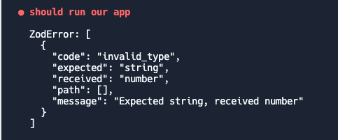
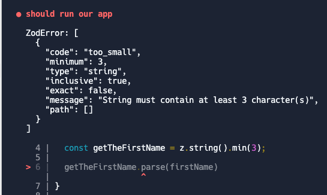
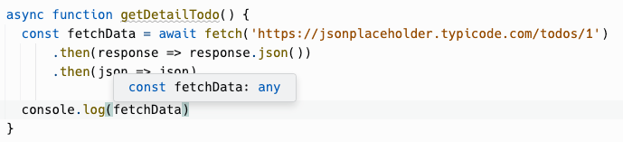
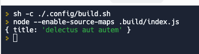
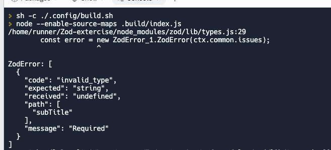
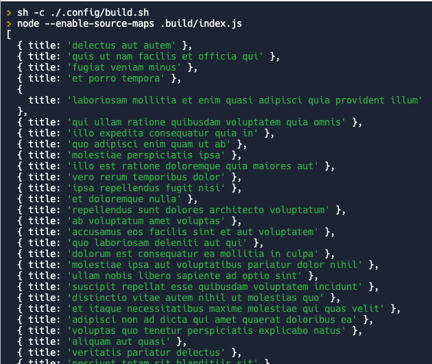
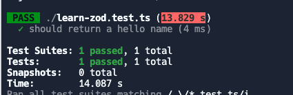
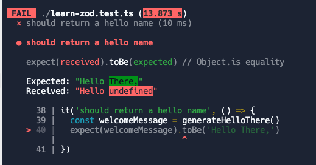
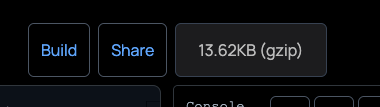

From last week on the Weekend until this week (On the Weekend too) mostly I’m learning about Zod; basically, it’s a schema validation that can be run on the runtime too, which mostly I use TypeScript just for the type-checking for the development purpose but, according to the documentation the name of the “schema” it’s broadly referring to any data type, from a simple `string` to a complex nested object.

In the above statements, I also told you that Zod will validate the schema on the runtime too not just check the type of the object, array, etc. The cool thing is, it will throw us an error if we do not meet the schema that we already defined it. Let’s take an example from `string` API from Zod.

# Validate An Unknown Data

We know if we still use JavaScript as our main code, we cannot make sure the parameters of our function it’s a data that we need or not. The same like in TypeScript too, if we write a function that accepts arguments with type _unknown_, we need to make sure the parameters or data that we will proceed on our function.

So in Zod, we can make sure that with just write a simple two line of code like this.

```typescript
import { z } from "zod";

function submitAddressUser(address: unknown) {
  const getAddress = z.string();
  getAddress.parse(address);

  return address;
}
```

We can see above code, that the parameters that we write are unknown — which means we assume that we don’t know that value exactly so if we run that function and give an argument that we don’t want it like `number`

```typescript
it("should run our app", () => {
  const testIt = submitAddressUser(123412);
  expect(testIt).toBe("cool address");
});
```

If we run it



We will receive a throwing error because we don’t give a proper argument of a function `submitAddressUser` this should be an error on runtime if we run it on the browser.

# A Simple User Story

Previously, we already wrote a simple Zod API which is `string` but in that API there’s also a lot of functionality that we can use, for example:

```typescript
import { z } from "zod";

function testTheApp(firstName: string) {
  const getTheFirstName = z.string().min(3);
  getTheFirstName.parse(firstName);

  return firstName;
}
```

If we try to input our form which does not meet that schema, then we should get an error.

```typescript
it("should run our app", () => {
  const getMyFirstName = testTheApp("Ad");
  expect(getMyFirstName).toBe("Ad");
});
```

Here’s the error that was returned from Zod.



That indicates that we got a schema validation of our function `testTheApp` with minimal character is three.

# Mix it With Rest API

The most interesting in this part, we can catch it even on the runtime let’s assume that we call a Rest API with TypeScript and normal `fetch`.

```typescript
import { z } from "zod";

async function getDetailTodo() {
  const fetchData = await fetch("https://jsonplaceholder.typicode.com/todos/1")
    .then((response) => response.json())
    .then((json) => json);

  console.log(fetchData);
}
```

As you know unlike GraphQL when we use `fetch` then the data from the variable `fetchData` should become unknown or any which means we don’t know the response it.



Fortunately, with Zod, we can create a schema that should return what we need from that response of API.

```typescript
import { z } from "zod";

async function getDetailTodo() {
  const validateResponse = z.object({
    title: z.string(),
  });

  const fetchData = await fetch("https://jsonplaceholder.typicode.com/todos/1")
    .then((response) => response.json())
    .then((json) => json);

  const data = validateResponse.parse(fetchData);
  return data;
}
```

For the explanation of the above code, we have a variable `validateResponse` to create a schema that just gives us a field `title` from the response of that API, if we take a look at the API there are several fields from the response

```typescript
{
    "userId": 1,
    "id": 1,
    "title": "delectus aut autem",
    "completed": false
}
```

But in our schema which is `validateResponse` we just want `title` apart from other fields, if we try to console it



Zod also filters the rest of the fields that are not needed on our schema, but, if we change the schema and then let’s say we want a field `subTitle`

```typescript
import { z } from "zod";

async function getDetailTodo() {
  const validateResponse = z.object({
    title: z.string(),
    subTitle: z.string(),
  });

  const fetchData = await fetch("https://jsonplaceholder.typicode.com/todos/1")
    .then((response) => response.json())
    .then((json) => json);

  const data = validateResponse.parse(fetchData);
  return data;
}
```

If we run our app



We can see that Zod will throw us an error which is we need to change the response of that API to make sure our schema meets the response of the API.

# Infer The Type

We already see the power from Zod with API `object` which is it can be like a schema validation to make sure what we need is what we have too. But, let’s say back to the previous topic we use this function

```typescript
import { z } from "zod";

async function getDetailTodo() {
  const validateResponse = z.object({
    title: z.string(),
  });

  const fetchData = await fetch("https://jsonplaceholder.typicode.com/todos/1")
    .then((response) => response.json())
    .then((json) => json);

  const data = validateResponse.parse(fetchData);
  return data;
}
```

As we know TypeScript will infer the return type of the function based on what we return it from our function, but let’s say we have a case that we need the type of the schema too and use that type on other function helpers for example, we can use the API from Zod that called `infer`

```typescript
import { z } from "zod";

const validateResponse = z.object({
  title: z.string(),
});

export type DetailTodoData = Promise<z.infer>;

async function getDetailTodo(): DetailTodoData {
  const fetchData = await fetch("https://jsonplaceholder.typicode.com/todos/1")
    .then((response) => response.json())
    .then((json) => json);

  const data = validateResponse.parse(fetchData);
  return data;
}
```

# Array

In Zod, we also have an API that we can interact with the data type `Array` — For example, we have this function

```typescript
async function getListTodo() {
  const fetchData = await fetch("https://jsonplaceholder.typicode.com/todos")
    .then((response) => response.json())
    .then((json) => json);

  return fetchData;
}
```

If we try to hit that API we will see a lot of the data of todos

```typescript
[
    {
        "userId": 1,
        "id": 1,
        "title": "delectus aut autem",
        "completed": false
    },
    {
        "userId": 1,
        "id": 2,
        "title": "quis ut nam facilis et officia qui",
        "completed": false
    },
    ...
]
```

Then, let’s say in that list we just want to show a field `title` to the user, we can also use an API from Zod that is called `array`

```typescript
import { z } from "zod";

async function getListTodo() {
  const validateTheResponse = z.array(
    z.object({
      title: z.string(),
    }),
  );

  const fetchData = await fetch("https://jsonplaceholder.typicode.com/todos")
    .then((response) => response.json())
    .then((json) => json);

  const data = validateTheResponse.parse(fetchData);
  return data;
}
```

If we try to see the return of our function, it will automatically filter the data based on the schema that we created above.



# Default Value and Optional Schema

We know on TypeScript we can also make our type optional then within the function we can give a default value.

```typescript
function generateHelloThere(name?: string) {
  const getName = name || "There,";

  return `Hello ${getName}`;
}
```

Then let’s say we have a test case like this

```typescript
it("should return a hello name", () => {
  const welcomeMessage = generateHelloThere();
  expect(welcomeMessage).toBe("Hello There,");
});
```

It should give us a default value



But, in Zod, they already provide us with an API to make a default value and mark it as optional.

```typescript
import { z } from "zod";

function generateHelloThere(name?: string) {
  const schemaName = z.string().optional().default("There,");
  const getName = schemaName.parse(name);

  return `Hello ${getName}`;
}
```

Then after we run our test case


The lack of this API, we need to make sure the `.optional()` The API needs to call it first before `.default('There,')` API. The `default()` API should be the last resort of the schema, if not our test case would give us an error



# The Cons

After we talked about the API that was provided by Zod, this package also has cons from my point of view. When we check the bundle size of this package from "bundlejs site"



It’s kinda big around 13KB even though it’s already has been gzip.

# Conclusion

Zod, it’s totally game-changer if we need to make sure our type on our function will catch it too on the runtime, as we mentioned above there a cons to this package, but if you don’t think about the bundle size of your app, I think you can consider shipping this package to help to you as a guardian too on the runtime.

Apart from writing it on TypeScript, Zod will also help you too on your app if already written with JavaScript in my perspective.

Also, there’s so much API that we did not mention here you can take a look by yourself from the [official documentation](https://github.com/colinhacks/zod#optional).
\
\
Thank you.
