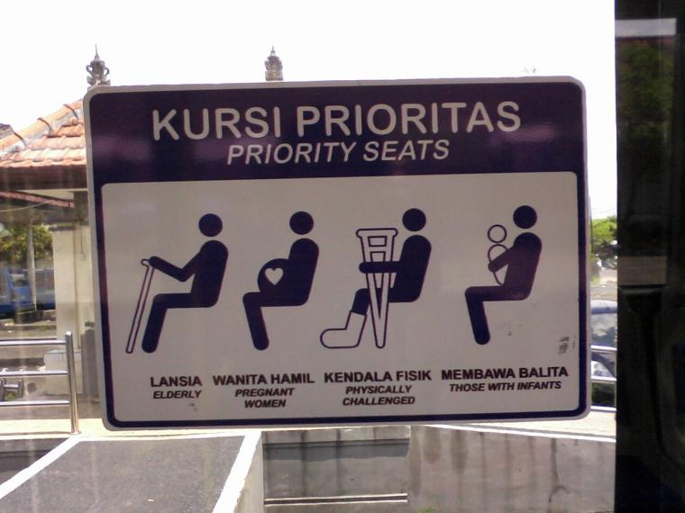
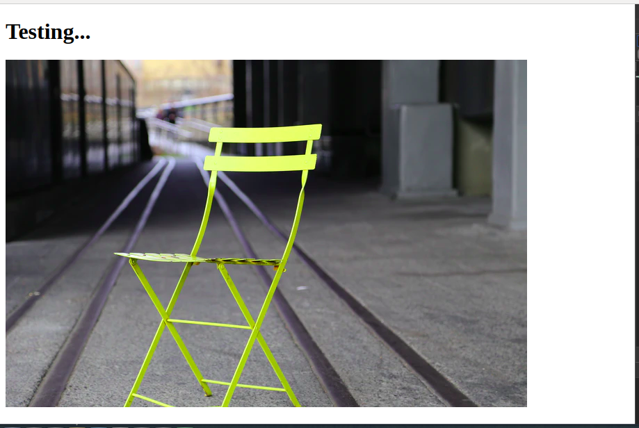
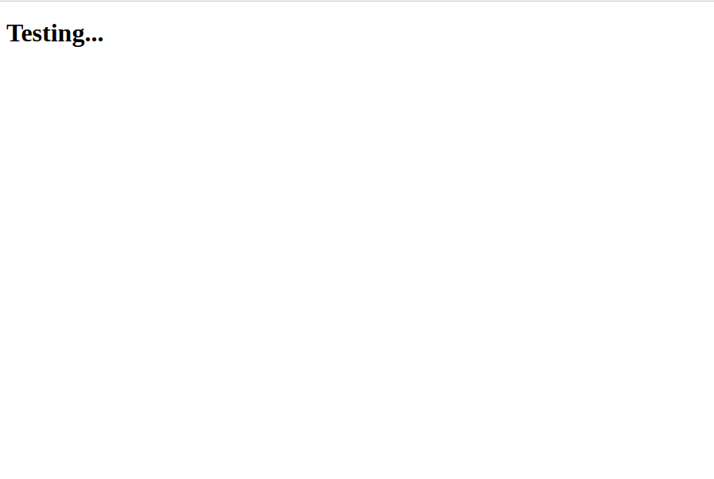

## Pendahuluan

Ya pada hari ini saya akan membagikan sebuah catatan penting tentang sebuah prioritas, bisa dikatakan kita akan berbicara tentang kursi prioritas pada website.

Lalu apa sebenarnya yang dimaksud dengan kursi priortias? yaa benar, seperti kita menaiki sebuah busway (angkutan umum) setidaknya didalam ada sebuah kursi prioritas, seperti ini



tetapi, jika pada sebuah website ada beberapa prioritas yang harus kita fokuskan, maksudnya apa? ya layaknya sebuah angkutan umum, tentu orang-orang seperti lansia dan lain sebagainya itu akan kita dahulukan, lalu jika pada website ini ada urutannya juga yaitu; `Highest`, `High`, `Medium` dan terakhir `Low`. Lalu pada saat kapan source code kita dikategorikan dalam ke-empat hal tersebut?

## Highest

Yang pertama `Highest` ketika kita menempatkan code kita pada bagian tag `<head>` dengan bantuan tag `<link>` otomatis source code kita entah itu JavaScript atau CSS, akan dikategorikan sebagai prioritas yang `Highest` tetapi biasanya browser akan menempatkan posisi CSS sebagai prioritas pertama dahulu, makanya ketika kita menempatkan sebuah code pada bagian tag `<head>` itu akan menjadi sebuah render blocking atau bisa dibilang seperti ini _"tolong jangan render apapun pada website ini, tunggu script pada tag <head> itu selesai semua"_.

```html
<!DOCTYPE html>
<html lang="en">
  <head>
    <meta charset="UTF-8" />
    <meta name="viewport" content="width=device-width, initial-scale=1.0" />
    <title>Test</title>
    <link rel="stylesheet" href="./app.css" />
  </head>
  <body>
    <h1>Testing...</h1>
  </body>
</html>
```

dan jika kita lihat di network, akan seperti ini


## High

Yang kedua ada `High` langsung saja kita akan lihat code seperti ini.

```html
<!DOCTYPE html>
<html lang="en">
  <head>
    <meta charset="UTF-8" />
    <meta name="viewport" content="width=device-width, initial-scale=1.0" />
    <title>Test</title>
    <script src="./app.js"></script>
    <script src="./app2.js"></script>
  </head>
  <body>
    <h1>Testing...</h1>
  </body>
</html>
```

dan ketika menempatkan dua buah script JS di dalam tag `<head>` otomatis script diatas akan di prioritaskan menjadi `High`


## Medium dan Low

Yang terakhir ada `Medium` dan `Low` nah kedua prioritas ini yang biasanya browser tidak akan otomatis mengubah prioritasnya, maksudnya apa? jadi pada prioritas sebelumnya yaitu `High` dan lihat code HTMLnya saya menempatkannya pada tag `<head>` lalu bagaimana jika kita menempatkannya seperti biasa yang berada didalam tag `<body>` dan kita menambahkan sebuah image didalam tag `<body>` juga?

```html
<!DOCTYPE html>
<html lang="en">
  <head>
    <meta charset="UTF-8" />
    <meta name="viewport" content="width=device-width, initial-scale=1.0" />
    <title>Test</title>
  </head>
  <body>
    <h1>Testing...</h1>
    
    <script src="./app.js"></script>
    <script src="./app2.js"></script>
  </body>
</html>
```

yaa ada yang unik ketika kita mengubahnya dalam tag `<body>` dan menambahkan image maka hasilnya akan seperti ini.


lihat, JavaScript code kita akan berubah prioritasnya menjadi `Medium` dan image kita berubah menjadi `High` hmm jadi karena urutan HTML kita diatas adalah posisinya `Image > JS` maka image kita akan diprioritaskan terlebih dahulu, tapi ada tapinya nih image akan diprioritaskan menjadi `High` karena dia berada didalam `viewport` browser maksudnya apa? mari kita eksekusi code HTML kita yang diatas, tampilannya akan seperti ini.



Kalian lihat kan imagenya? yaa bisa dibilang itu adalah `viewport` kalian, ketika saya tambahkan css pada tag `h1`

```html
...
<h1 style="margin-bottom:100vh;">Testing...</h1>

...
```

dan resultnya akan seperti ini



kalian tidak melihat imagenya lagi bukan? yaa berarti itu bukan bagian dari `viewport` kalian, dan otomatis browser akan merubah prioritas imagenya menjadi seperti ini.


berubah bukan prioritas imagenya?

---

Dari awal saya hanya menuliskan catatan tentang bagian-bagian prioritas pada website, sebenarnya kita bisa berbuat curang (kalau di browser ya..!!) yaitu dengan cara, `Preload`, `Prefetch` dan `Preconnect` dan kita akan menggunakan tag `<link>` dan di sisipkan pada tag `<head>` hmm yuk coba kita coret-coret dibawah.

## Memotong antrian prioritas

Seperti yang kita mention sebelumnya, bahwa default sebuah prioritas (code) kita pada sebuah browser ialah tergantung pada penempatan posisi script kita entah di tag `<head>` atau pada bagian tag `<body>`, ketika kalian merasa bahwa code yang kalian buat itu sangat penting dan memang dibutuhkan secepatnya coba gunakan `Preload` atau `Preconnect` dan ketika code kalian tidak dibutuhkan sama sekali, katakanlah sebuah script dialog, dimana dialog tersebut hanya dibutuhkan ketika user meng-klik sebuah button.

## Preload

Ini adalah metode dimana kita bisa memberitahukan browser seperti ini _"tolong download file dengan type ini, secepat mungkin"_ jadi metode ini yang akan meng-eksekusi code kita secepat mungkin, dan ini akan menjadi prioritas yang `High`

```html{7-8}
<!DOCTYPE html>
<html lang="en">
  <head>
    <meta charset="UTF-8" />
    <meta name="viewport" content="width=device-width, initial-scale=1.0" />
    <title>Test</title>
    <link rel="preload" href="./app.js" as="script" />
    <link rel="preload" href="./app2.js" as="script" />
  </head>
  <body>
    <h1>Testing...</h1>
    
  </body>
</html>
```

dengan kita menambahkan `preload` otomatis kedua script diatas akan menjadi `render-blocking` yaitu kedua script diatas harus di load terlebih dahulu baru script browser akan mulai me-render website kita. Ada beberapa use-case yang biasanya menggunakan `preload` ini yaitu:

- Men-load font
- Men-load script yang memang sangat penting atau disebut juga dengan _Critical Resources_

tetapi ketika menggunakan `preload` ini kalian nanti akan menemukan sebuah warning seperti ini


warning diatas merupakah sebuah tanda kedua script diatas itu tidak digunakan dalam waktu 3 detik, jadi browser akan mengoceh _tolong donk kedua script ini tidak digunakan sekitar 3 detik, mending ganti prioritasnya yaa_.

## Preconnect

Kalau cara ini, bisa dibilang begini sih, misalkan kita akan akses beberapa code atau data dari domain `https://example.com` nah dengan preconnect ini kita akan memberitahu browser _"tolong dong hit dulu example.com lalu ketika saya sudah membutuhkan sesuatu dari web tersebut, tinggal saya download saja ya?"_ hmm kira kira begini, kelakuan browser ketika dia belum punya `preconnect`


jadi browser akan nunggu dulu source yang sebelumnya untuk proses download, lalu dia akan menjalankan source selanjutnya dengan mencoba mengkoneksikan terlebih dahulu lalu mendownload apa yang dibutuhkan. Lalu ketika saya menambahkan ini.

```html
... <link rel="preconnect" href="https://example.com" /> ...
```

proses sebuah browser akan seperti ini


ini jelas jelas sungguh berbeda, dan biasanya hal seperti ini adalah use-casenya ketika kita mencoba stream sesuatu entah itu video atau audio, diibaratkan kita tidak ingin berurusan dengan connecting ke halaman sumber video atau audio kita, ketika user mencoba menekan tombol play, yaa seharusnya dia hanya mendownload sourcenya saja, tanpa harus menunggu apakah koneksinya berhasil atau tidak ke halaman yang dituju.

## Prefetch

Ini adalah cara yang saya senangi, dengan cara ini bisa dikatakan kita mencoba merubah prioritas sebuah script atau style kita menjadi `Low` atau bahkan lebih rendah lagi seperti `Lowest` lihatlah code dibawah ini

```html
<!DOCTYPE html>
<html lang="en">
  <head>
    <meta charset="UTF-8" />
    <meta name="viewport" content="width=device-width, initial-scale=1.0" />
    <title>Test</title>
    <!-- JS utama saya -->
    <link rel="preload" href="./app.js" as="script" />

    <!-- ini adalah code buat bikin dialog/modal -->
    <link rel="prefetch" href="./app.css" as="style" />
    <link rel="prefetch" href="./app2.js" as="script" />
  </head>
  <body>
    <h1>Testing...</h1>
    
  </body>
</html>
```

kita akan berasumsi pada code ditas ialah, untuk code yang berfungsi untuk bikin dialog dan modal itu dibutuhkan gak secepatnya, bisa dikatakan seperti ini ke browser _"tolong donk download code untuk bikin dialog/modal tersebut tapi jangan sampai render blocking ya..!!"_ dan hasil prioritas pada browser akan seperti ini.


bisa diliat bahwa code untuk membuat dialog/modal kita mendapatkan prioritas `Lowest` yaa jadi bener bener dibutuhkan belakangan tanpa harus membuat render-blocking.

## Pengingat pribadi

Saya sebenarnya bebas menggunakan apapun metode load file pada website saya, tetapi saya harus make sure apakah file yang saya gunakan benar benar digunakan di page tersebut atau sebenarnya file yang saya buat itu kasusnya seperti membuat dialog sepert diatas, atau malah lebih parahnya lagi file yang tidak dipakai langsung di page itu malah mempengaruhi render blocking. Saran untuk saya sendiri coba gunakan ini [GuessJS](https://guess-js.github.io/). Terima Kasih
