Jadi sebelum negara api menyerang, WEB yang kita buat itu sebenarnya tidak bisa kita tempatkan pada play store, karena play store sendiri secara umum isinya adalah aplikasi yang berbasis android, contoh ketika kita mempunyai WEB [contohweb.com](#) dan kita rasa ternyata target user kita banyak yang mempunyai HP android otomatis kita harus membuat sebuah APP yang berbasis android ntah itu dengan Java atau Kotlin.
\
\
Tetapi tanpa bahasa native pun kita bisa membuat sebuah APP dan di tempatkan di play store yaitu dengan [React Native](https://reactnative.dev/), [IONIC](https://ionicframework.com/), atau juga dengan WebView, lalu adakah cara kita tanpa harus menulis kode dua kali? jadi pengennya sih ketika kita membuat WEB kita pengen juga versi APP androidnya ada juga gitu, lalu bagaimana caranya?

## Trusted Web Activity (TWA)

Ya sesuai judulnya TWA, TWA sendiri ialah sebuah cara yang memungkinkan kita menempatkan WEB kita di play store dengan bantuan [_custom tabs_](https://developer.chrome.com/multidevice/android/customtabs), tetapi bedanya dengan WebView apa? jelas berbeda WebView banyak sekali _gap_ yang terjadi, contohnya saja perihal _cache_. Pada WebView _caching_ tidak akan berarti apa - apa atau bisa dibilang tidak bekerja dengan maksimal, contohnya ketika kita membuka APP yang dibungkus dengan WebView, pada saat kunjungan pertama kali kita akan mendownload assets web tersebut ntah itu (JS, Image, CSS dan lain sebagainya) jika pada kasus normal, sebuah WEB akan mendownload assets lalu itu akan menjadi sebuah _cache_ yang akan berguna untuk kunjungan kita selanjutnya yang supaya kita tidak mendownload lagi assets yang sudah kita download pada saat kunjungan pertama kali, nah jika kondisi di WebView hal ini tidak akan berjalan maksimal alhasil kita akan mendownload assets WEB tersebut setiap kita membuka APP yang dibungkus dengan WebView.

## Hal menarik tentang TWA

Ada beberapa hal yang menarik pada TWA sendiri diantaranya:

- Seperti native: ya ini adalah keunggulan utamanya, dengan sedikit merubahnya menjadi PWA kita bisa merasakan WEB yang berasa seperti native.
- Tidak memakan resource HP yang begitu banyak bahkan mungkin kurang dari 1MB seperti [OYO Lite](https://play.google.com/store/apps/details?id=com.oyo.consumerlite) ini yang sudah menerapkan TWA.
- Support offline
- Loading yang cepat, tetapi kita akan merasakan sedikit transisi yang berbeda dengan native android APP dimana dia sudah mendownload semua assetsnya diawal.
- _Update on the fly_ maksudnya ialah ketika kita ada bug di production dan harus di bereskan segera, maka kita tidak perlu meng-update di play store, cukup kita update webnya saja.

hal - hal diatas adalah sebagian kecil dari kenimatan dari TWA itu sendiri, jika kalian ingin menemukan hal menarik lainnya, kita akan mulai mencoba membuat TWA APP kita.

## Membuat Simple TWA APP

Oke kita akan membuat simple aja dari TWA ini, nah pertama - tama kalian harus membuat sebuah WEB dulu pastinya harus dengan lolos PWA lighthouse bagian performance itu minimal 80 dan tentunya sudah ada checklis PWA, saya ada sebuah contoh WEB PWA saya dulu [ini WEBnya](https://pedantic-hawking-bfb7d9.netlify.app/)

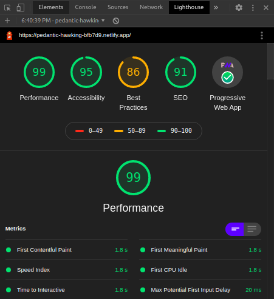

nah setelah itu kalian bisa memulai build TWA APP kalian, ada beberapa cara yang bisa dilakukan, yaitu:

- Bubblewrap, yaitu tools ChromeLabs yang memungkinkan kita bisa mengenerate APK atau mengecek apak WEB kita sudah bisa menggunakan TWA atau belum silahkan [kesini](https://github.com/GoogleChromeLabs/bubblewrap).
- Manual, bisa dibilang ini adalah cara yang akan kita gunakan, karena kita juga ingin tau apa sih yang di lakukan dibalik layarnya.

langsung ke tahap pertama, kalian harus membuka dahulu android studio, dan kalian pilih yang membuat project baru lalu pilih saja yang _No Activity_

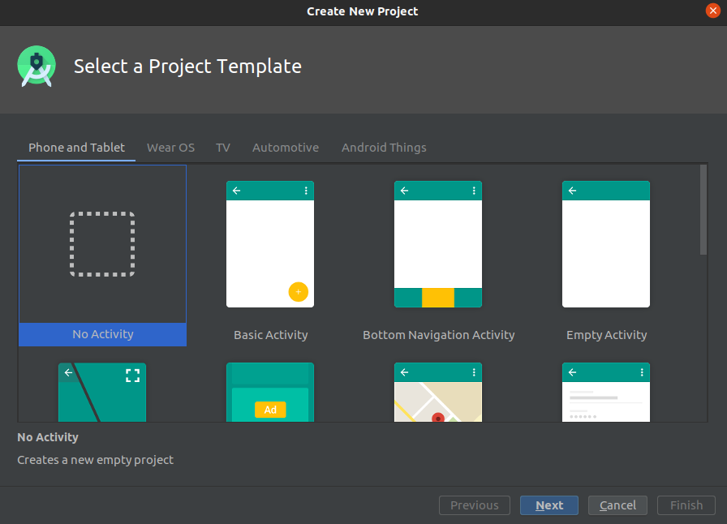

lalu ketika next kira - kira desc dari project kita seperti ini

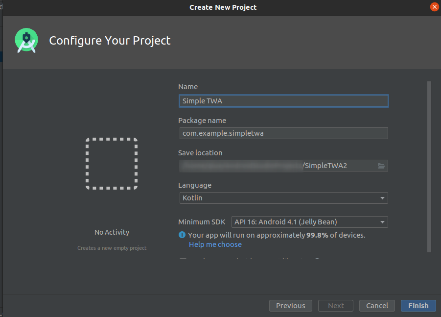

**klik finish**, lalu kalian buka file `build.gradle` dengan tulisan `Module: app` dan tambahkan beberapa file ini

```java
android {
  ...
  defaultConfig {
    applicationId "com.example.simpletwa"
    minSdkVersion 16
    targetSdkVersion 30
    versionCode 1
    versionName "1.0"

    testInstrumentationRunner "androidx.test.runner.AndroidJUnitRunner"
  }
  ...
}

dependencies {
  ...
  implementation 'com.google.androidbrowserhelper:androidbrowserhelper:1.3.0'
  ...
}
```

dan ketika kalian menambahkan beberapa line code baru, android studio akan memberitahukan bahwa, APP yang kita buat itu harus segera di _sync_ kan, lalu tekan saja _Sync Now_ seperti dibawah ini

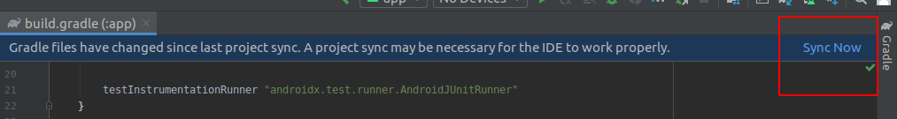

tahap dasar membuat pondasi TWA sudah selesai, lalu selanjutnya kita akan mendaftarkan WEB kita kedalam APP android kita, maksudnya ialah simplenya kita akan membuat sebuah **kepastian** antara WEB kita dengan android APP kita, kira - kira seperti itu. Selanjutnya buka file `AndroidManifest.xml` posisinya ada disebalah sini (lihat gambar dibawah).

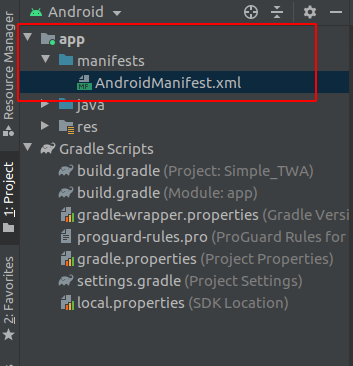

lalu kalian buka filenya lalu tambahkan code dibawah ini, mulai dari yang sudah di _highlight_

```xml{11-29}
<manifest xmlns:android="http://schemas.android.com/apk/res/android"
    package="com.example.simpletwa">

    <application
        android:allowBackup="true"
        android:icon="@mipmap/ic_launcher"
        android:label="@string/app_name"
        android:roundIcon="@mipmap/ic_launcher_round"
        android:supportsRtl="true"
        android:theme="@style/AppTheme">
        <activity android:name="com.google.androidbrowserhelper.trusted.LauncherActivity">

            <!-- ubah android:value sesuai kebutuhan kalian yang akan membuat keyakinan antara WEB dan APP kita dan akan menjadi TWA -->
            <meta-data android:name="android.support.customtabs.trusted.DEFAULT_URL" android:value="https://pedantic-hawking-bfb7d9.netlify.app" />

            <intent-filter>
                <action android:name="android.intent.action.MAIN" />
                <category android:name="android.intent.category.LAUNCHER" />
            </intent-filter>

            <intent-filter>
                <action android:name="android.intent.action.VIEW"/>
                <category android:name="android.intent.category.DEFAULT" />
                <category android:name="android.intent.category.BROWSABLE"/>

                <!-- ubah android:host menjadi sesuai web kalian -->
                <data android:scheme="https" android:host="pedantic-hawking-bfb7d9.netlify.app"/>
            </intent-filter>
        </activity>
    </application>

</manifest>
```

lalu ketika kalian sudah menambahkannya, kalian coba untuk menjalankan TWA kalian dengan menekan ini

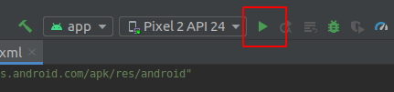

dan ketika dibuka tadaaa, kalian sudah melihat WEB kalian didalam sebuah aplikasi atau sudah menjadi TWA

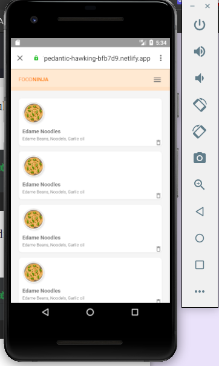

ada yang aneh bukan? ya ada URL-barnya pada APP kita, selanjutnya kita akan membuat namanya **Digital AssetLinks.**
\
\
Apa sih yang dimaksud dengan **Digital AssetLinks**? secara singkatnya hal ini yang menyatukan atau bisa dibilang membuat kepercayaan yang sangat kuat antara WEB kita dengan APP yang tidak buat dan juga hal ini lah yang membuat URL bar yang tadi kita buat akan hilang dan tampilan akan benar - benar seperti native APP keren bukan? jika ingin tahu lebih lanjut silahkan mampir [kesini](https://developers.google.com/digital-asset-links/v1/getting-started).

## Membuat surat perjanjian

Jadi pada section ini kita akan membuat surat perjanjian, dimana surat/file ini akan ditempatkan di WEB kita. Jadi pertama - tama kalian buka android studio kalian dan lihat diseblah kanan ada tab namanya `Gradle`

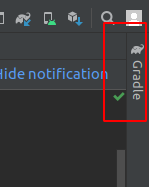

kemudian kalian buka dan klik dua kali pada perintah yang bernama `signingReport` yang posisinya ada disini

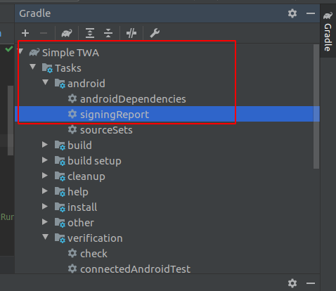

jadi perintah tersebut akan men-generate key `SHA-256` dimana key ini akan kita gunakan nanti pada WEB kita, lalu ketika sudah dijalakan maka hasilnya akan seperti ini.

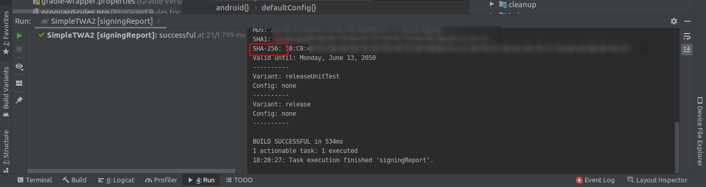

jangan ditutup dibiarkan dulu saja, lalu kalian buka repository WEB kalian, dan buat lah sebuah route dengan format `https://<web kalian>/.well-known/assetlinks.json` jadi file `assetlinks.json` ini untuk apa sih? nah file itu akan berfungsi sebagai surat perjanjian antara WEB kita dengan APP yang kita buat jadi, APP yang kita buat akan mensetuji segala aktifitas yang ada didalam APP kita, kira kira seperti itu, lalu file `assetlinks.json` dengan format seperti ini

```json
[
  {
    "relation": ["delegate_permission/common.handle_all_urls"],
    "target": {
      "namespace": "android_app",
      "package_name": "com.example.simpletwa",
      "sha256_cert_fingerprints": ["12:23:34:56"]
    }
  }
]
```

lalu pada key `sha256_cert_fingerprints` itu isinya adalah key `SHA-256` yang sudah kita generate pada android studio tadi, lalu jika sudah kita balik lagi ke android studio kita lalu buka file `AndroidManifest.xml` lalu tambahkan code ini

```xml{11}
<manifest xmlns:android="http://schemas.android.com/apk/res/android"
    package="com.example.simpletwa">

    <application
        android:allowBackup="true"
        android:icon="@mipmap/ic_launcher"
        android:label="@string/app_name"
        android:roundIcon="@mipmap/ic_launcher_round"
        android:supportsRtl="true"
        android:theme="@style/AppTheme">
        <meta-data android:name="asset_statements" android:resource="@string/asset_statements" />
        ...
    </application>

</manifest>
```

lalu kalian buka file `app > res > values > strings.xml` lalu tambahkan code dibawah ini

```xml
<resources>
    <string name="app_name">Simple TWA</string>
    <string name="asset_statements">
        [{
            \"relation\": [\"delegate_permission/common.handle_all_urls\"],
            \"target\": {
                \"namespace\": \"web\",
                \"site\": \"https://pedantic-hawking-bfb7d9.netlify.app\"}
        }]
    </string>
</resources>
```

lalu ganti `site` dengan url WEB yang kalian punya, dan tadaaa URL bar yang mengganggu sudah tidak ada lagi

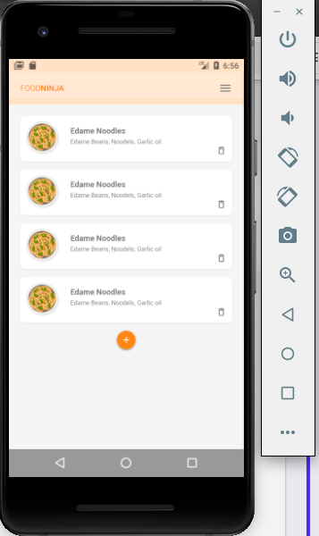

lihat seperti native APP pada umumnya bukan? saya hanya sampai disini aja jadi jika kalian ingin menambahkan splash screen misalnya, kalian harus mencobanya sendiri karena saya sendiri tidak tahu :peace:

## Beberapa catatan

Setelah kita membuat simple TWA ada beberapa catatan yang harus diperhatikan, yaitu, full screen hanya jalan ketika chrome version lebih dari **72**, jika user dibawah versi itu maka URL bar tetap terlihat, lalu bagaimana cara menghandle hal tersebut? jadi pada package `Custom Tab` yang sudah kita tambahkan pada APP kita melalui android studio tadi, dia ada fungsi yang namanya `TrustedWebUtils.chromeNeedsUpdate` jadi ini akan notice user bahwa chrome yang dipakai user itu support `TWA` atau tidak, jika tidak kita akan tampilkan WebView, dan juga jika default browser user bukan chrome maka kita jika tampilkan WebView sebagai fallbacknya, memang WebView sendiri ada kekurangan seperti yang sudah kita bahas sebelumnya tetapi, lihat dulu apakah user yang mendapatkan WebView ini signifikan? jika iya, tetap native APP adalah satu satunya cara.
\
\
Terima Kasih.
