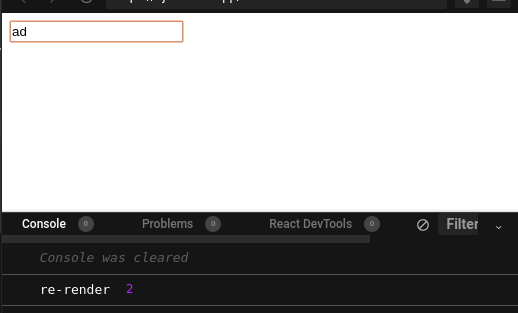
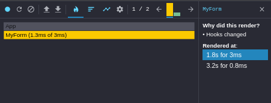
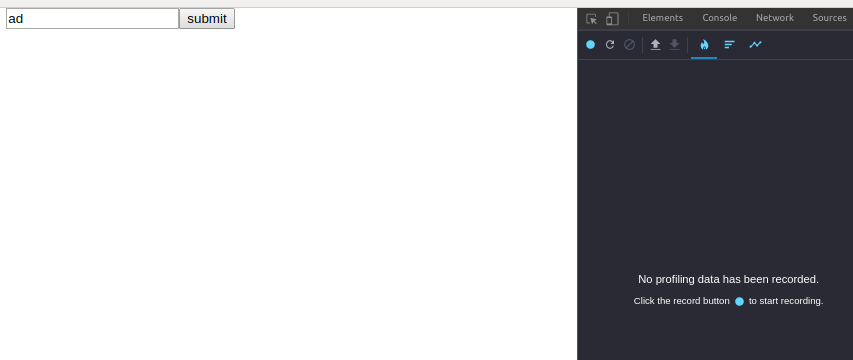
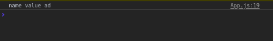
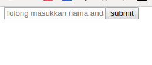

Aktifitas sebuah form pasti sangat tidak asing pada sebuah web, ntah itu hanya menuliskan sebuah nama, email dan lain sebagainya. Terkadang ketika menyimpan data tersebut kita hanya sekedar menyimpannya pada sebuah state biasa seperti ini

```jsx
function MyForm() {
  const [name, setName] = useState('')

  return (
    <form>
      <input
        placeholder="Tolong masukkan nama anda"
        type="text"
        value={name}
        onChange={e => setName(e.target.value)}
      />
    </form>
  )
}

export default MyForm
```

memang hal diatas adalah hal yang normal biasa kita lakukan untuk melakukan sebuah re-render atau merender ulang apa yang di ketikan oleh user pada sebuah input form. Lalu ketika user mengetikan nama mereka pada form tersebut tanpa kita sadari Form tersebut sudah melakukan re-render sesering user mengetikan nama mereka, contoh seperti ini



contoh ketika saya mengetikan nama dua huruf saja huruf _a_ dan _d_ form kita sudah melakukan re-render 2 kali, untuk memastikan lagi kita akan melihat devtools react dan yaa hal itu benar-benar terjadi, dan hal tersebut dinamakan _Reconciliation_



lalu bagaimana kita mencegah hal tersebut? apakah kita tetap membutuhkan sebuah re-render app kita, ketika user hanya mengetikan beberapa huruf pada sebuah input? saya rasa hal itu tak perlu dilakukan, karena ketika kita tidak mendeklar sebuah state pun form input itu akan tetap ter-isi seperti biasa

```jsx
function MyForm() {
  return (
    <form>
      <input placeholder="Tolong masukkan nama anda" type="text" />
    </form>
  )
}
```

seharusnya kita tetap bisa menuliskan sebuah nama pada input yang telah kita buat dengan normal, lihat? kita tidak mendeklarasikan sebuah state tetapi bisa jalan dengan normal bukan? Lalu bagaimana kita mengambil value input tersebut? pertama-tama kita akan mengubahnya sedikit menjadi seperti ini

```jsx
function MyForm() {
  function handleSubmitForm(e) {
    e.preventDefault()
    console.log('tombol submit ter-klik')
  }

  return (
    <form onSubmit={handleSubmitForm}>
      <input placeholder="Tolong masukkan nama anda" type="text" name="name" />
      <button type="submit">submit</button>
    </form>
  )
}
```

yaa kode diatas adalah kode normal yang biasa kita buat pada sebuah form, yaitu ada sebuah `function` untuk menghandle submit form tersebut, lalu bagaimana kita mengambil value input dari user? kita akan merubah fungsi `handleSubmitForm` menjadi seperti ini

```jsx
//...
function handleSubmitForm(e) {
  e.preventDefault()
  const { name } = e.target.elements

  console.log('name value', name.value)
}
// ...
```

yap kita akan mencoba memasukan sebuah nama pada input kita dan, kita pastikan tidak ada re-render pada form kita lagi



lihat devtool tidak mendeteksi ada proses render pada form kita, lalu bagaimana apa kita tetap dapat valuenya? jawabannya YA



ya lihat kita mendapatkan value form tersebut, dari kode ini

```jsx
// ...
const { name } = e.target.elements

console.log('name value', name.value)
// ...
```

lalu apa itu `e.target.elements`? itu adalah sebuah element FORM yang dimana kita buat pada html yaitu `<form></form>` jadi bisa dibilang kita bisa ambil semua input sampai dengan buttonnya sekali-pun dengan cara tersebut, lalu ada destructing object `const { name }` apa ini? kita lihat HTML kita dulu

```html
<input placeholder="Tolong masukkan nama anda" type="text" name="name" />
```

nah yang variable `name` tadi kita dapat dari input diatas dengan attribut `name="name"` jadi katakanlah ketika kita mengubahnya dengan `name="namaSaya` maka nanti cara mengambilnya pun dengan cara

```js
const { namaSaya } = e.target.elements
```

lihat mudah bukan? kalau bahasa kerennya ini adalah _Uncontrolled Component_ jadi maksudnya yaa benar-benar kita tidak menhandle mulai dari form value sampai dengan trigger change input tersebut.

---

Lalu misalkan kita punya data dari sebuah API, bagaimana kita memasukkan data tersebut kedalam form kita tadi? saya akan membuat _fake_ API dan kita akan sedikit merubah kode form kita menjadi seperti ini

```jsx
function MyForm() {
  const [name, setName] = useState('')

  function handleSubmitForm(e) {
    e.preventDefault()
    const { name } = e.target.elements

    console.log('name value', name.value)
  }

  useEffect(() => {
    ;(function getName() {
      setTimeout(() => {
        setName('adib')
      }, 1000)
    })()
  }, [])

  return (
    <form onSubmit={handleSubmitForm}>
      <input placeholder="Tolong masukkan nama anda" type="text" name="name" />
      <button type="submit">submit</button>
    </form>
  )
}
```

lihat kode diatas saya membuat sebuah _fake_ API dimana saya akan men-set sama `adib` setelah satu detik coba dijalankan bagaimana? apa `input` itu tetep kosong atau sudah terisi?



input itu tetap kosong lalu bagimana selanjutnya?

```jsx
...
<input
  placeholder="Tolong masukkan nama anda"
  type="text"
  name="name"
  defaultValue={name}
/>
...
```

yaps ada penambahan atribut yaitu `defaultValue` atribut tersebut yang akan mengisi `input` kita dengan value yang kita ambil dari fungsi `getName` di dalam sebuah `useEffect`.

## Rangkuman

Hal yang dilakukan diatas adalah antara perlu dan tidak sih, karena kalau hal yang biasa kita gunakan dengan menggunakan sebuah `state` biasa tetep berjalan normal dan tidak mengganggu user, maka tidak perlu melakukan sebuah _Uncontrolled Component_ dan kita harus memastikan terlebih dahulu sebelum benar-benar menggunakan teknik ini.
